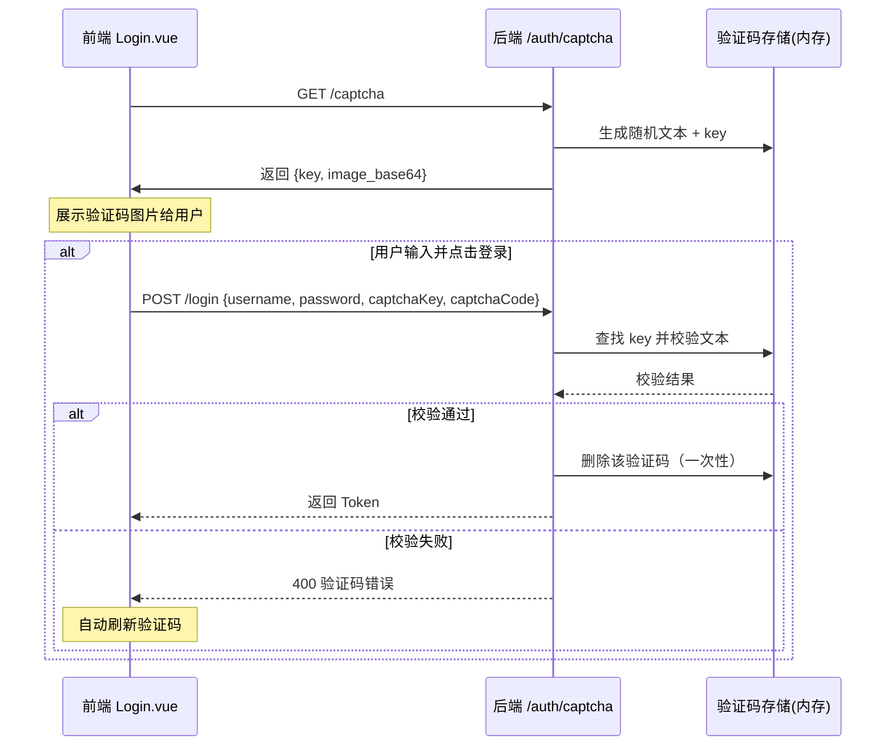

# API 接口参考文档

> **文档编号**: LMS-API-001  
> **所属产品**: 图书馆管理系统  
> **API 版本**: v1.0  
> **Base URL**: `/api/v1`  
> **认证方式**: Bearer Token (JWT)  
> **数据格式**: JSON  

---

## 1. 接口概览

### 1.1 模块划分

| 模块 | 路径前缀 | 接口数量 | 主要功能 |
|------|----------|----------|----------|
| **认证** | `/auth` | 7 | 注册/登录/验证码/令牌/密码/用户信息 |
| **图书** | `/books` | 8 | 图书CRUD/搜索/详情/副本 |
| **借阅** | `/borrows` | 8 | 借/还/续借/批量/查询 |
| **预约罚款** | `/reservations` + `/fines` | 10 | 预约CRUD + 罚款CRUD |
| **评分推荐** | `/books/{id}/ratings` 等 | 6 | 评分/评论/个性化推荐 |
| **统计** | `/statistics` | 11 | 看板/趋势/排行/导出 |
| **系统** | `/logs`, `/configs`, `/users`, etc. | 25+ | 日志/配置/用户/分类/节假日/通知/荐购/角色 |
| **角色** | `/roles` | 5 | RBAC 角色管理 |
| **健康检查** | `/health` | 1 | 系统健康状态 |

### 1.2 通用约定

#### 请求头

```
Authorization: Bearer <access_token>
Content-Type: application/json
```

#### 统一响应格式

**成功响应 (200)**:
```json
{
  "code": 200,
  "message": "success",
  "data": { ... },
  "timestamp": "2026-04-08T23:00:00Z"
}
```

**列表响应 (200)**:
```json
{
  "code": 200,
  "message": "success",
  "data": {
    "items": [ ... ],
    "total": 100,
    "page": 1,
    "size": 20,
    "pages": 5
  },
  "timestamp": "2026-04-08T23:00:00Z"
}
```

**错误响应**:
```json
{
  "detail": "错误描述",
  // 或 HTTP标准状态码 + message
}
```

#### 分页参数

| 参数 | 类型 | 默认 | 说明 |
|------|------|------|------|
| `page` | integer | 1 | 页码（≥1） |
| `size` | integer | 20 | 每页条数（1~100） |

---

## 2. 认证模块 (`/auth`)

### 2.1 用户注册

```
POST /api/v1/auth/register
```

**请求体**:
```json
{
  "username": "zhangsan",
  "email": "zhangsan@example.com",
  "phone": "13800138000",
  "password": "Zhangsan1!",
  "reader_type": "student"
}
```

**响应 (201)**: `UserResponse`

**校验规则**:
- `username`: 3-50字符，唯一
- `email`: 有效邮箱格式，唯一
- `password`: ≥8位，必须包含大写字母+小写字母+数字+特殊字符
- `reader_type`: student / staff / public / admin（默认 student）
- 注册后角色固定为 **reader**

---

### 2.2 用户登录

```
POST /api/v1/auth/login
```

**请求体**:
```json
{
  "username": "admin",        // 支持用户名或邮箱
  "password": "Admin@123456",
  "captchaKey": "a1b2c3d4...", // 验证码唯一标识（必填）
  "captchaCode": "A7XK"       // 用户输入的验证码文本（必填）
}
```

**响应 (200)**: `TokenResponse`
```json
{
  "access_token": "eyJhbGciOiJIUzI1NiJ9...",
  "refresh_token": "eyJhbGciOiJIUzI1NiJ9...",
  "token_type": "bearer",
  "expires_in": 3600,                          // 会话有效期（秒），默认 1 小时
  "session_expires_at": "2026-04-13T12:22:00Z"  // 会话到期时间（ISO 8601）
}
```

**会话生命周期说明**:
| 字段 | 类型 | 说明 |
|------|------|------|
| `expires_in` | number | Token/会话有效时长（秒），前端用于倒计时 |
| `session_expires_at` | string | 精确的会话到期时间，前端用于超时检测 |

> **安全策略**：用户登录后获得 **1 小时会话生命周期**。前端每 30 秒检测剩余时间，距离过期 **5 分钟** 时弹出续期提醒，过期则强制登出。刷新令牌（refresh token）有效期仍为 7 天。

**错误响应 (400)**: 验证码错误或已过期
```json
{"detail": "验证码错误或已过期，请重新获取"}
```

---

### 2.2.1 获取登录验证码 ⭐ 新增

```
GET /api/v1/auth/captcha
```

**说明**: 获取用于登录防刷的图形验证码（无需认证）

**请求参数**: 无

**响应 (200)**: `CaptchaResponse`
```json
{
  "captcha_key": "a1b2c3d4e5f6g7h8i9j0k1l2m3n4o5p6",  // 验证码唯一标识，提交登录时需带回
  "captcha_image": "iVBORw0KGgoAAAANSUhEUgAA...",      // Base64 编码的 PNG 图片
  "expire_in": 300                                        // 有效期（秒），默认5分钟
}
```

**验证码特性**:
| 特性 | 说明 |
|------|------|
| 字符集 | 大写字母(A-Z) + 数字(2-9)，排除易混淆字符(0/O, 1/I/L) |
| 长度 | 4 位 |
| 有效期 | 300 秒（5分钟） |
| 使用次数 | 一次性（校验后立即失效） |
| 大小写 | 不敏感（统一转大写比较） |
| 干扰元素 | 随机背景色 + 3~5 条干扰线 + 50~100 个干扰点 |
| 图片格式 | PNG（Base64 编码） |

**使用流程图**:


---

### 2.3 令牌刷新

```
POST /api/v1/auth/refresh
```

**请求体**:
```json
{
  "refresh_token": "eyJhbGciOiJIUzI1NiJ9..."
}
```

**响应 (200)**: `TokenResponse` （新令牌对）

---

### 2.4 获取当前用户信息

```
GET /api/v1/auth/me
```

**Auth**: 需要 Bearer Token

**响应 (200)**:
```json
{
  "code": 200,
  "data": {
    "user_id": 1,
    "username": "admin",
    "email": "admin@example.com",
    "role": "super_admin",
    "status": "active",
    "reader_type": "admin",
    "permissions": ["dashboard:read", "book:create", ...],
    "created_at": "2026-01-01T00:00:00Z"
  }
}
```

---

### 2.5 修改密码

```
PUT /api/v1/auth/change-password
```

**请求体**:
```json
{
  "old_password": "旧密码",
  "new_password": "NewPassword1!"
}
```

**响应 (200)**:
```json
{"code": 200, "message": "密码修改成功"}
```

---

### 2.6 管理员重置密码

```
PUT /api/v1/auth/{user_id}/reset-password
```

**权限**: super_admin

**请求体**:
```json
{"new_password": "NewResetPassword1!"}
```

---

## 3. 图书模块 (`/books`)

### 3.1 图书列表查询

```
GET /api/v1/books
```

**查询参数**:

| 参数 | 类型 | 必填 | 说明 |
|------|------|------|------|
| `title` | string | 否 | 书名模糊搜索 |
| `author` | string | 否 | 作者模糊搜索 |
| `isbn` | string | | ISBN 精确匹配 |
| `category_id` | int | 否 | 分类ID |
| `status` | string | 否 | 状态筛选 |
| `page` | int | 否 | 页码 |
| `size` | int | 否 | 每页条数 |

---

### 3.2 全文检索

```
GET /api/v1/books/search?query=Python
```

**参数**: `query`(string, 最短1字符) - 在书名/作者/ISBN/描述中 OR 模糊匹配

---

### 3.3 图书详情

```
GET /api/v1/books/{book_id}
```

**附加返回数据**:
```json
{
  "book_id": 1,
  "title": "Python编程",
  "author": "Eric Matthes",
  "isbn": "9787161414744",
  "category_name": "计算机科学",
  "copies": [
    {"copy_id": 1, "barcode": "9787161414-1-001", "status": "available", "location_detail": "3楼A区"}
  ],
  "total_copies": 3,
  "available_copies": 2
}
```

---

### 3.4 添加图书

```
POST /api/v1/books
```

**权限**: catalog_admin / super_admin

**请求体**: `BookCreate`
```json
{
  "isbn": "9787161414744",
  "title": "Python编程",
  "author": "Eric Matthes",
  "publisher": "人民邮电出版社",
  "publish_year": 2024,
  "category_id": 1,
  "location": "3楼计算机区",
  "price": 89.00,
  "cover_url": "https://example.com/cover.jpg",
  "description": "从入门到实践...",
  "call_number": "TP311P45",
  "total_copies": 3
}
```

**自动化**: 自动创建3个 BookCopy（条码自动生成），若 ISBN 已存在则累加 total_copies

---

### 3.5 更新图书

```
PUT /api/v1/books/{book_id}
```

**权限**: catalog_admin / super_admin

**请求体**: `BookUpdate`（所有字段可选，仅提交需要修改的字段）

---

### 3.6 删除图书（逻辑删除）

```
DELETE /api/v1/books/{book_id}
```

**权限**: catalog_admin / super_admin

**前提**: 无借出中的副本 → 否则 400 错误

---

### 3.7 物理理删除

```
DELETE /api/v1/books/{book_id}/physical
```

**权限**: catalog_admin / super_admin

**操作**: 永久移除图书及其关联的所有数据（副本/评论/评分/预约），写入审计日志

---

### 3.8 添加副本

```
POST /api/v1/books/{book_id}/copies?copies_count=5
```

**权限**: catalog_admin / super_admin

---

### 3.9 条码查询

```
GET /api/v1/borrows/lookup-copy?barcode={barcode}
```

**权限**: circulation_admin / super_admin

**返回**: copy_id, barcode, status, location_detail, book_id, title, author, isbn

---

## 4. 借阅模块 (`/borrows`)

### 4.1 检查借阅资格

```
GET /api/v1/borrows/check-eligibility/{user_id}
```

**返回**:
```json
{
  "code": 200,
  "data": {
    "eligible": true/false,
    "reason": "已达到最大借阅数量10本",
    "reader": {
      "user_id": 5,
      "username": "zhangsan",
      "max_borrow_count": 10,
      "current_active_borrows": 8,
      "status": "active"
    }
  }
}
```

---

### 4.2 单本借阅

```
POST /api/v1/borrows
```

**权限**: circulation_admin / super_admin

**请求体**: `BorrowCreate`
```json
{"user_id": 5, "copy_id": 12}
```

---

### 4.3 批量借阅

```
POST /api/v1/borrows/batch
```

**权限**: circulation_admin / super_admin

**请求体**: `BatchBorrowCreate`
```json
{"user_id": 5, "copy_ids": [12, 13, 14]}
```

**返回**:
```json
{
  "success_count": 2,
  "fail_count": 1,
  "success_items": [
    {"copy_id": 12, "borrow_id": 101, "due_date": "2026-05-08"}
  ],
  "fail_items": [
    {"copy_id": 13, "reason": "副本不可借（borrowed）"}
  ]
}
```

---

### 4.4 归还图书

```
POST /api/v1/borrows/{borrow_id}/return
```

**权限**: 管理员可代还；读者只能还自己的

**请求体** (可选): `BorrowReturn`
```json
{"return_branch": "分馆A"}  // 异地还书
```

**返回**:
```json
{
  "code": 200,
  "message": "还书成功",
  "data": {
    "borrow_id": 101,
    "return_date": "2026-04-08T15:30:00",
    "fine_amount": 2.50,
    "overdue_days": 5,
    "has_reservation": true,
    "auto_frozen": false,
    "return_branch": null
  }
}
```

---

### 4.5 续借

```
POST /api/v1/borrows/{borrow_id}/renew
```

**权限**: 管理员可代办；读者只能续自己的

**返回**:
```json
{
  "borrow_id": 101,
  "old_due_date": "2026-04-08",
  "new_due_date": "2026-04-25",
  "renew_count": 1,
  "max_renew_count": 2,
  "renew_days": 15
}
```

---

### 4.6 借阅记录列表

```
GET /api/v1/borrows
```

**查询参数**:

| 参数 | 类型 | 说明 |
|------|------|------|
| `user_id` | int | 按用户ID筛选 |
| `status_filter` | string | active/returned/overdue |
| `keyword` | string | 书名/读者名模糊搜索 |
| `page` | int | 页码 |
| `size` | int | 每页条数 |

---

### 4.7 借阅详情

```
GET /api/v1/borrows/{borrow_id}
```

---

### 4.8 逾期信息

```
GET /api/v1/borrows/{borrow_id}/overdue-info
```

**返回**:
```json
{
  "is_overdue": true,
  "due_date": "2026-04-01",
  "current_date": "2026-04-08",
  "total_overdue_days": 7,
  "grace_days": 3,
  "chargeable_days": 4,
  "daily_fine_rate": 0.5,
  "estimated_fine": 2.00
}
```

---

## 5. 预约与罚款模块

### 5.1 预约相关接口

| 方法 | 路径 | 说明 |
|------|------|------|
| POST | `/reservations` | 发起预约 |
| GET | `/reservations` | 预约列表 |
| POST | `/reservations/{id}/cancel` | 取消预约 |
| POST | `/reservations/{id}/pickup` | 取书确认（馆员操作） |
| POST | `/reservations/check-expired` | 检查超时预约 |
| GET | `/reservations/book/{book_id}/queue` | 查看排队 |

### 5.2 罚款相关接口

| 方法 | 路径 | 说明 |
|------|------|------|
| GET | `/fines` | 罚款列表 |
| POST | `/fines/{id}/pay` | 缴纳罚款 |
| POST | `/fines/damage` | 创建损坏赔偿 |
| POST | `/fines/loss` | 创建丢失赔偿 |
| POST | `/fines/{id}/waive` | 免除罚款 |
| GET | `/users/{user_id}/fines/summary` | 罚款汇总 |

---

## 6. 评分推荐模块

| 方法 | 路径 | 说明 |
|------|------|------|
| POST | `/books/{id}/ratings` | 评分(1-5星) |
| GET | `/books/{id}/ratings` | 评分统计+分布 |
| GET | `/books/{id}/comments` | 公开评论列表 |
| POST | `/books/{id}/comments` | 发表评论 |
| PUT | `/comments/{comment_id}` | 管理员审核评论 |
| GET | `/recommendations/personalized` | 个性化推荐 |
| GET | `/recommendations/new-books` | 新书上架 |
| GET | `/recommendations/hot` | 热门排行 |

---

## 7. 统计分析模块

| 方法 | 路径 | 说明 | 参数 |
|------|------|------|------|
| GET | `/statistics/dashboard` | 运�营看板 | - |
| GET | `/statistics/my-dashboard` | 个人看板 | - |
| GET | `/statistics/borrow-trend` | 借阅趋势 | days |
| GET | `/statistics/hot-books` | 热门图书 | days, limit |
| GET | `/statistics/category-distribution` | 分类分布 | - |
| GET | `/statistics/overdue-report` | 逾期报表 | - |
| GET | `/statistics/active-readers` | 活跃读者 | days, limit |
| GET | `/statistics/dormant-books` | 沉睡图书 | days |
| GET | `/statistics/circulation-rate` | 流通率统计 | - |
| GET | `/statistics/overdue-readers` | 高频逾期读者 | limit |
| GET | `/statistics/export/borrow-report` | 导出CSV | type, start_date, end_date |

---

## 8. 系统管理模块

### 8.1 用户管理

| 方法 | 路径 | 权限 | 说明 |
|------|------|------|------|
| POST | `/users` | super_admin | 创建用户（自动生成读者证号） |
| GET | `/users` | admin | 用户列表（支持搜索/筛选/分页） |
| GET | `/users/{id}` | admin | 用户详情（含借阅统计） |
| PUT | `/users/{id}` | super_admin | 更新用户（含审计快照） |
| DELETE | `/users/{id}` | super_admin | 删除用户（软删除） |
| POST | `/users/{id}/suspend` | super_admin | 禁用用户 |
| POST | `/users/{id}/activate` | super_admin | 激活用户 |
| **读者证子接口**: issue / loss / replace / get (见PRD-RBAC) | circulation_admin | - |

### 8.2 其他系统接口

| 模块 | 接口数量 | 关键接口 |
|------|----------|---------|
| 角色权限 | 5 | CRUD + init-default |
| 分类管理 | 4 | CRUD（树形结构） |
| 系统配置 | 3 | GET list / POST create / PUT key |
| 节假日 | 5 | GET / POST / PUT / DELETE + batch |
| 消息通知 | 6 | GET list / unread-count / read / read-all / DELETE / POST send |
| 审计日志 | 2 | GET list (筛选/分页) / export CSV |
| 荐购管理 | 3 | GET list / POST create / PUT review |
| 健康检查 | 1 | GET /health |

---

## 9. 错误码参考

| HTTP Code | 场景 | 说明 |
|-----------|------|------|
| **200** | 成功 | 操作成功完成 |
| **201** | 创建成功 | 新资源创建成功 |
| **400** | 请求错误 | 参数校验失败 / 业务规则违反 |
| **401** | 未认证 | 缺少或无效Token / Token过期 |
| **403** | 无权限 | 权限不足 |
| **404** | 不存在 | 请求的资源不存在 |
| **409** | 冲突 | 资源已存在（如用户名重复） |
| **422** | 不可处理 | 语义/语法错误 |
| **422** | 验证失败 | Pydantic 校验失败 |
| **500** | 服务器错误 | 内部错误 |

---

## 10. WebSocket / 长连接 (规划中)

当前版本基于 RESTful API + 轮询，暂无 WebSocket 接口。以下功能建议未来版本实现：

| 功能 | 规划版本 | 说明 |
|------|----------|------|
| 实时借阅提醒 | v1.2 | 到期/即将到期推送 |
| 实时座位占用 | v1.3 | 座位状态同步 |
| 协作编辑 | v1.2 | 管理员在线批注 |

---

*本文档提供了 v1.0 版本的全部 API 接口定义，包括请求方法、路径、参数、权限要求和响应格式，是前后端对接开发的核心参考文档。Swagger UI (`/api/docs`) 可提供交互式在线调试能力。*
