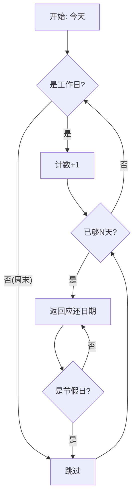
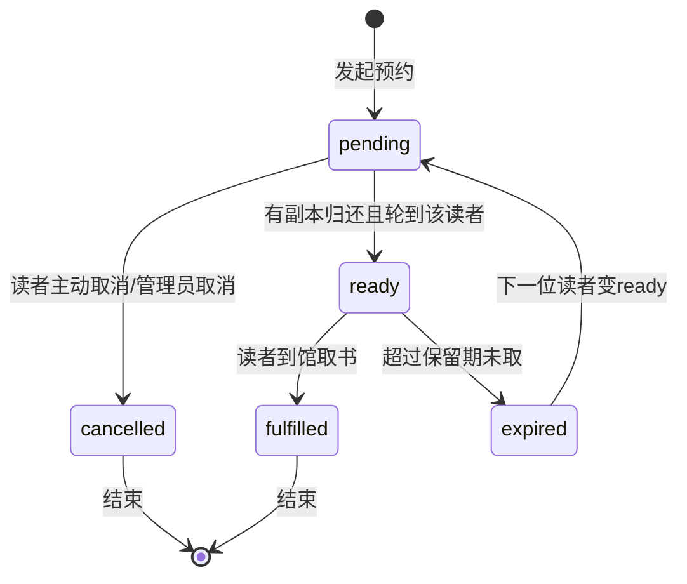

# 数据模型与 ER 图文档

> **文档编号**: LMS-DATA-001  
> **所属产品**: 图书馆管理系统  
> **数据库**: SQLite (默认) / PostgreSQL / MySQL  
> **ORM**: SQLAlchemy 2.0  

---

## 1. 数据模型总览

### 1.1 实体关系总览

```
                        ┌─────────────┐
                        │    User     │  用户表
                        └──────┬──────┘
              ┌───────────────┼───────────────┐
              │               │               │
              ▼               ▼               ▼
     ┌──────────┐   ┌───────────┐   ┌──────────────┐
     │ BorrowRecord│   │  Reservation│   │     Fine      │
     └─────┬────┘   └─────┬─────┘   └──────┬───────┘
          │              │                  │
          ▼              ▼                  ▼
   ┌───────────┐   ┌───────────┐   ┌──────────────┐
   │  BookCopy  │   │    Book    │   │BookRating   │
   └─────┬─────┘   └─────┬─────┘   └──────────────┘
         │               │
         └───────┬────────┘
                 │
                 ▼
         ┌───────────┐
         │  Category  │
         └───────────┘

  ══════════════════════════════╗
  ║     辅助实体（无外键强关联）       ║
  ╠═════════════════════════════╣
  ║  Role / SystemConfig / Holiday  ║
  ║  Notification / SystemLog /      ║
  ║  PurchaseRequest / BookComment     ║
  ╚═════════════════════════════╝
```

### 1.2 实体统计

| 类型 | 数量 | 实体名称列表 |
|------|------|--------------|
| **核心业务实体** | **6** | User, Book, BookCopy, BorrowRecord, Reservation, Fine |
| **互动实体** | **2** | BookRating, BookComment |
| **管理实体** | **7** | Role, Category, SystemConfig, Holiday, Notification, SystemLog, PurchaseRequest |
| **合计** | **15** | — |

---

## 2. 核心实体详细定义

### 2.1 User（用户表）

| 字段名 | 类型 | 约束 | 说明 |
|--------|------|------|------|
| `user_id` | Integer | PK, 自增, 索引 | 用户主键 |
| `username` | String(50) | UNIQUE, NOT NULL, 索引 | 登录用户名 |
| `password_hash` | String(255) | NOT NULL | bcrypt 加密后的密码哈希 |
| `email` | String(100) | UNIQUE, 索引 | 邮箱（可用于登录） |
| `phone` | String(20) | | 手机号 |
| `role` | Enum(UserRole) | NOT NULL, 默认 `reader` | 角色枚举：super_admin / catalog_admin / circulation_admin / reader / auditor |
| `status` | Enum(UserStatus) | NOT NULL, 默认 `active` | 状态：active / inactive / suspended |
| `reader_card_number` | String(50) | UNIQUE, 索引 | 读者证号（自动生成：RD+年+类型码+序号） |
| `reader_type` | String(50) | | 读者类型：student / staff / public / admin |
| `max_borrow_count` | Integer | 默认 10 | 最大借阅数量（根据读者类型自动设置） |
| `borrow_limit_days` | Integer | 默认 30 | 借阅期限（天） |
| `created_at` | DateTime | auto_now | 创建时间 |
| `updated_at` | DateTime | onupdate | 更新时间 |

#### User 枚举类型

```python
class UserRole(str, enum.Enum):
    SUPER_ADMIN = "super_admin"
    CATALOG_ADMIN = "catalog_admin"
    CIRECTION_ADMIN = "circulation_admin"  # 注意: 实际是 CIRCULATION_ADMIN
    READER = "reader"
    AUDITOR = "auditor"

class UserStatus(str, enum.Enum):
    ACTIVE = "active"
    INACTIVE = "inactive"
    SUSPENDED = "suspended"
```

#### User 关联关系

```
User 1:N BorrowRecord     (作为借阅者)
User 1:N Reservation      (作为预约者)
User 1:N Fine             ( as 被罚款对象)
User 1:N PurchaseRequest   ( as 荐购申请人)
User 1:N SystemLog        ( as 操作者)
User 1:N Notification      ( as 通知接收者)
```

---

### 2.2 Role（角色权限表）

| 字段名 | 类型 | 约束 | 说明 |
|--------|------|------|------|
| `role_id` | Integer | PK, 自增, 索引 | 角色主键 |
| `role_name` | String(50) | UNIQUE, NOT NULL | 角色名称（对应 UserRole 枚举值或自定义角色） |
| `permissions` | Text | JSON 格式 | 权限列表 JSON 数组字符串 |
| `description` | String(200) | 角色描述 |
| `created_at` | DateTime | auto_now | 创建时间 |

> **设计说明**: permissions 存储为 JSON 字符串，运行时解析为 Python List。这允许灵活的权限组合而不需要修改数据库 schema。

---

### 2.3 Category（图书分类表）

| 字段名 | 类型 | 约束 | 说明 |
|--------|------|------|------|
| `category_id` | Integer | PK, 自增, 索引 | 分类主键 |
| `name` | String(100) | NOT NULL | 分类名称 |
| `parent_id` | Integer | FK → categories.category_id | 父分类ID（NULL表示根节点） |
| `level` | Integer | 默认 1 | 层级深度（根=1, 子=2, 孙=3...） |
| `sort_order` | Integer | 默认 0 | 同级排序权重 |
| `created_at` | DateTime | auto_now | 创建时间 |

#### Category 树形结构

```
Category (根节点 level=1)
├── 文学 (level=1)
│   ├── 小说 (level=2)
│   │   ├── 中国文学 (level=3)
│   │   └── 外国文学 (level=3)
│   └── 诗歌 (level=2)
├── 科技 (level=1)
│   ├── 计算机 (level=2)
│   └── 数学 (level=2)
└── 艺术 (level=1)
```

#### Category 关联关系
```
Category 1:N Book        (一个分类下有多本书)
Category 1:N Category     (自引用，形成树形结构)
```

---

### 2.4 Book（图书主表）

| 字段名 | 类型 | 约束 | 说明 |
|--------|------|------|------|
| `book_id` | Integer | PK, 自增, 索引 | 图书主键 |
| `isbn` | String(20) | 索引 | ISBN 号（国际标准书号） |
| `title` | String(200) | NOT NULL | 书名（必填） |
| `author` | String(100) | | 作者 |
| `publisher` | String(100) | | 出版社 |
| `publish_year` | Integer | | 出版年份 |
| `category_id` | Integer | FK → categories.category_id | 所属分类 |
| `location` | String(100) | | 存放位置（书架号/楼层） |
| `status` | Enum(BookStatus) | 默认 `available` | 图书状态 |
| `total_copies` | Integer | 默认 1 | 总副本数 |
| `available_copies` | Integer | 默认 1 | 可借副本数 |
| `price` | Float | | 图书定价 |
| `cover_url` | String(500) | | 封面图片 URL |
| `description` | Text | | 图书简介/摘要 |
| `call_number` | String(50) | 索引 | 索书号（分类排架号） |
| `created_at` | DateTime | auto_now | 入库时间 |
| `updated_at` | DateTime | on_update | 最后更新时间 |

#### Book 枚举状态

```python
class BookStatus(str, enum.Enum):
    AVAILABLE = "available"    # 可借
    BORROWED = "borrowed"      # 已借出
    RESERVED = "reserved"      # 已预约
    DAMAGED = "damaged"       # 已损坏
    LOST = "lost"            # 已丢失
    WITHDRAWN = "withdrawn"    # 已下架
```

#### Book 关联关系
```
Book N:1 Category         (属于一个分类)
Book 1:N BookCopy         (有多个副本)
Book 1:N Reservation      (可被多人预约)
Book 1:N BookRating        (多条评分)
Book 1:N BookComment       (多条评论)
```

---

### 2.5 BookCopy（图书副本表）

| 字段名 | 类型 | 约束 | 说明 |
|--------|------|------|------|
| `copy_id` | Integer | PK, 自增, 索引 | 副本主键 |
| `book_id` | Integer | FK → books.book_id, NOT NULL | 所属图书 |
| `barcode` | String(50) | UNIQUE, NOT NULL, 索引 | **条形码**（物理标识） |
| `status` | Enum(CopyStatus) | 默认 `available` | 副本状态 |
| `location_detail` | String(100) | | 详细存放位置（如：3楼A区第5排） |
| `acquisition_date` | DateTime | auto_now | 入馆日期 |
| `created_at` | DateTime | auto_now | 创建时间 |

#### CopyStatus 枚举
```python
class CopyStatus(str, enum.Enum):
    AVAILABLE = "available"    # 可借
    BORROWED = "borrowed"      # 借出中
    RESERVED = "reserved"      # 预留（预约者待取）
    DAMAGED = "damaged"       # 损坏
    LOST = "lost"            # 丢失
    WITHDRAWN = "withdrawn"    # 已注销
```

#### 条码生成规则
```python
barcode = f"{book.isbn or 'ISBN'}-{book.book_id}-{i+1:03d}"
# 示例: 978703XXXXX-1-001, 978703XXXXX-1-002
```

---

### 2.6 BorrowRecord（借阅记录表）

| 字段名 | 类型 | 约束 | 说明 |
|--------|------|------|------|
| `borrow_id` | Integer | PK, 自增, 索引 | 借阅记录主键 |
| `user_id` | Integer | FK → users.user_id, NOT NULL | 借阅者 |
| `copy_id` | Integer | FK → book_copies.copy_id, NOT NULL | 所借副本 |
| `borrow_date` | DateTime | auto_now, NOT NULL | 借阅日期 |
| `due_date` | DateTime | NOT NULL | **应还日期**（工作日计算，跳过周末和节假日） |
| `return_date` | DateTime | | 实际归还日期 |
| `return_branch` | String(100) | | 归还分馆（支持异地还书） |
| `status` | Enum(BorrowStatus) | 默认 `active` | 借阅状态 |
| `fine_amount` | Float | 默认 0 | 罚款金额 |
| `operator_id` | Integer | FK → users.user_id | 经办人（馆员） |
| `renew_count` | Integer | 默认 0 | 已续借次数 |
| `created_at` | DateTime | auto_now | 创建时间 |

#### BorrowStatus 枚举
```python
class BorrowStatus(str, enum.Enum):
    ACTIVE = "active"      # 借阅中
    RETURNED = "returned"    # 已归还
    OVERDUE = "overdue"      # 逾期
    LOST = "lost"          # 丢失
```

#### 应还日期计算规则


---

### 2.7 Reservation（预约记录表）

| 字段名 | 类型 | 约束 | 说明 |
|--------|------|------|------|
| `reservation_id` | Integer | PK, 自增, 索引 | 预约主键 |
| `user_id` | Integer | FK → users.user_id, NOT NULL | 预约人 |
| `book_id` | Integer | FK → books.book_id, NOT NULL | 目标图书 |
| `reservation_date` | DateTime | auto_now, NOT NULL | 预约时间 |
| `expiry_date` | DateTime | | 到期时间（变为ready后设置） |
| `status` | Enum(ReservationStatus) | 默认 `pending` | 预约状态 |
| `queue_position` | Integer | | **排队位置**（同书多人预约时） |
| `notification_sent` | Boolean | 默认 False | 是否已发送到书通知 |
| `created_at` | DateTime | auto_now | 创建时间 |

#### 预约状态机



---

### 2.8 Fine（罚款记录表）

| 字段名 | 类型 | 约束 | 说明 |
|--------|------|------|------|
| `fine_id` | Integer | PK, 自增, 索引 | 罚款主键 |
| `user_id` | Integer | FK → users.user_id, NOT NULL | 被罚款人 |
| `borrow_id` | Integer | FK → borrow_records.borrow_id | 关联的借阅记录（逾期/损坏时） |
| `fine_type` | Enum(FineType) | NOT NULL | 罚款类型 |
| `amount` | Float | NOT NULL | 罚款金额（元） |
| `status` | Enum(FineStatus) | 默认 `pending` | 罚款状态 |
| `paid_date` | DateTime | | 缴纳日期 |
| `created_at` | DateTime | auto_now | 创建时间 |

#### FineType 枚举
```python
class FineType(str, enum.Enum):
    OVERDUE = "overdue"   # 逾期罚款
    DAMAGE = "damage"     # 损坏赔偿
    LOSS = "loss"         # 丢失赔偿
```

#### FineStatus 枚举
```python
class FineStatus(str, enum.Enum):
    PENDING = "pending"   # 待缴纳
    PAID = "paid"         # 已缴纳
    WAIVED = "waived"       # 已免除
```

---

### 2.9 BookRating（图书评分表）

| 字段名 | 类型 | 约束 | 说明 |
|--------|------|------|------|
| `rating_id` | Integer | PK, 自增, 索引 | 评分主键 |
| `user_id` | Integer | FK → users.user_id, NOT NULL | 评分人 |
| `book_id` | Integer |FK → books.book_id, NOT NULL | 被评分图书 |
| `rating` | Integer | NOT NULL, 1~5 | 评分（1-5星） |
| `updated_at` | DateTime | on_update | 更新时间 |

> **约束**: 每人对每书只有一条评分记录（重复提交则 UPDATE）

---

### 2.10 BookComment（图书评论表）

| 字段名 | 类型 | 约束 | 说明 |
|--------|------|------|------|
| `comment_id` | Integer | PK, 自增, 索引 | 评论主键 |
| `user_id` | Integer | FK → users.user_id, NOT NULL | 评论人 |
| `book_id` | Integer | FK → books.book_id, NOT NULL | 被评图书 |
| `content` | Text | NOT NULL, 2~1000字符 | 评论正文 |
| `status` | Enum(CommentStatus) | 默认 `pending` | 审核状态 |
| `admin_reply` | Text | | 管理员回复 |
| `created_at` | DateTime | auto_now | 发布时间 |
| `updated_at` | DateTime | onupdate | 更新时间 |

#### CommentStatus 枚举
```python
class CommentStatus(str, enum.Enum):
    PENDING = "pending"    # 待审核
    APPROVED = "approved"  # 已通过（公开）
    HIDDEN = "hidden"       # 已隐藏
    REJECTED = "rejected"   # 已拒绝
```

---

### 2.11 辅助实体

#### 2.11.1 PurchaseRequest（荐购申请表）

| 字段 | 类型 | 约束 | 说明 |
|------|------|------|------|
| `request_id` | Integer | PK, 自增 | 主键 |
| `user_id` | Integer | FK → users | 申请人 |
| `book_title` | String(200) | NOT NULL | 推荐书名 |
| `author` | String(100) | | 推荐作者 |
| `isbn` | String(20) | | 推荐 ISBN |
| `reason` | Text | | 荐购理由 |
| `status` | Enum(PurchaseRequestStatus) | 默认 pending | 状态：pending/approved/rejected/purchased |
| `review_comment` | Text | | 审核意见 |
| `reviewer_id` | Integer | FK → users | 审核人 |
| `created_at` | DateTime | auto_now | 申请时间 |
| `updated_at` | DateTime | on_update | 更新时间 |

#### 2.11.2 SystemConfig（系统配置表）

| 字段 | 类型 | 约束 | 说明 |
|------|------|------|------|
| `config_id` | Integer | PK, 自增 | 配置ID |
| `config_key` | String(100) | UNIQUE, NOT NULL | 配置键名 |
| `config_value` | Text | 配置值 | 
| `description` | String(200) | 配置说明 |
| `updated_at` | DateTime | onupdate | 更新时间 |

**预置配置项**:

| 键名 | 默认值 | 说明 |
|------|--------|------|
| `DEFAULT_BORROW_DAYS` | 30 | 默认借阅期限（天） |
| `MAX_BORROW_COUNT` | 10 | 最大借阅数量 |
| `MAX_RENEW_COUNT` | 2 | 续借次数上限 |
| `RENEW_DAYS` | 15 | 续借延长期（天） |
| `DAILY_FINE_AMOUNT` | 0.5 | 每日逾期罚款（元） |
| `FINE_GRACE_DAYS` | 3 | 免罚宽限期（天） |
| `RESERVATION_HOLD_DAYS` | 3 | 预约保留天数（取书窗口） |
| `MAX_RESERVATION_COUNT` | 3 | 最大预约数量 |
| `fine_freeze_threshold` | 50 | 累计罚款冻结阈值（元） |

#### 2.11.3 Holiday（节假日表）

| 字段 | 类型 | 约束 | 说明 |
|------|------|------|------|
| `holiday_id` | Integer | PK, 自增 | 节假日ID |
| `name` | String(100) | NOT NULL | 节假日名称 |
| `date` | Date | NOT NULL | 日期（用于应还日期计算） |
| `year` | Integer | NOT NULL | 年份 |
| `created_at` | DateTime | auto_now | 创建时间 |

#### 2.11.4 Notification（通知表）

| 字段 | 类型 | 约束 | 说明 |
|------|------|------|------|
| `notification_id` | Integer | PK, 自增 | 通知ID |
| `user_id` | Integer | FK → users, NOT NULL | 接收人 |
| `title` | String(200) | NOT NULL | 通知标题 |
| `content` | Text | | 通知内容 |
| `type` | String(50) | 默认 "system" | 类型：system/reservation_ready/fine |
| `is_read` | Boolean | 默认 False | 是否已读 |
| `created_at` | DateTime | auto_now | 创建时间 |

#### 2.11.5 SystemLog（审计日志表）⭐

| 字段 | 类型 | 约束 | 说明 |
|------|------|------|------|
| `log_id` | Integer | PK, 自增, 索引 | 日志主键 |
| `operator_id` | Integer | FK → users | 操作人ID |
| `operation_type` | String(50) | NOT NULL | 操作类型（如 `user:create`, `book:delete`） |
| `target_type` | String(50) | | 目标对象类型（如 `User`, `Book`, `BorrowRecord`） |
| `target_id` | Integer | | 目标对象ID |
| `ip_address` | String(50) | | 操作IP地址 |
| `operation_time` | DateTime | NOT NULL | 操作时间 |
| `details` | Text | JSON | 操作详情（序列化的字典） |
| `before_data` | Text | JSON | **操作前数据快照**（ORM对象字典序列化） |
| `after_data` | Text | JSON | **操作后数据快照**（ORM对象字典序列化） |

> **核心设计原则**: 审计日志采用**只增不改**（Append-Only）策略，确保操作的完整追溯性。每次敏感操作都会记录变更前后的完整数据快照。

---

## 3. ER 实体关系图 (Mermaid)

```mermaid
erDiagram
    %% ========== 用户与认证 ==========
    User {
        int user_id PK "用户ID"
        string username UK "用户名"
        string password_hash "密码哈希"
        string email UK "邮箱"
        string phone "手机号"
        enum role "角色"
        enum status "状态"
        string reader_card_number UK "读者证号"
        string reader_type "读者类型"
        int max_borrow_count "最大借阅数"
        int borrow_limit_days "借阅期限"
        datetime created_at "创建时间"
        datetime updated_at "更新时间"
    }

    %% ========== 角色权限 ==========
    Role {
        int role_id PK "角色ID"
        string role_name UK "角色名称"
        text permissions "权限JSON"
        string description "描述"
        datetime created_at "创建时间"
    }

    User ||--o{ Role: "用户角色关联(枚举)" }
    
    %% ========== 图书体系 ==========
    Category {
        int category_id PK "分类ID"
        string name "分类名"
        int parent_id FK "父分类"
        int level "层级"
        int sort_order "排序"
        datetime created_at "创建时间"
    }
    
    Category ||--o{ Category: "自引用形成树形结构" }
    
    Book {
        int book_id PK "图书ID"
        string isbn INDEX "ISBN"
        string title "书名"
        string author "作者"
        string publisher "出版社"
        int publish_year "出版年"
        int category_id FK "分类"
        string location "存放位置"
        enum status "状态"
        int total_copies "总副本数"
        int available_copies "可借副本数"
        float price "定价"
        string cover_url "封面URL"
        text description "简介"
        string call_number "索书号"
        datetime created_at "入库时间"
        datetime updated_at "更新时间"
    }
    
    Category ||--o{ Book: "分类包含图书" }
    
    BookCopy {
        int copy_id PK "副本ID"
        int book_id FK "图书ID"
        string barcode UK "条形码"
        enum copy_status "副本状态"
        string location_detail "详细位置"
        datetime acquisition_date "入馆日期"
        datetime created_at "创建时间"
    }
    
    Book ||--o{ BookCopy: "图书拥有多个副本" }
    
    %% ========== 借阅流通 ==========
    BorrowRecord {
        int borrow_id PK "借阅ID"
        int user_id FK "用户ID"
        int copy_id FK "副本ID"
        datetime borrow_date "借阅日期"
        datetime due_date "应还日期"
        datetime return_date "归还日期"
        string return_branch "归还分馆"
        enum borrow_status "状态"
        float fine_amount "罚款金额"
        int operator_id FK "经办人"
        int renew_count "续借次数"
        datetime created_at "创建时间"
    }
    
    User ||--o{ BorrowRecord: "用户借阅记录" }
    BookCopy ||--o{ BorrowRecord: "副本被借记录" }
    
    %% ========== 预约系统 ==========
    Reservation {
        int reservation_id PK "预约ID"
        int user_id FK "用户ID"
        int book_id FK "图书ID"
        datetime reservation_date "预约时间"
        datetime expiry_date "到期时间"
        enum reservation_status "状态"
        int queue_position "排队位置"
        bool notification_sent "已通知"
        datetime created_at "创建时间"
    }
    
    User ||--o{ Reservation: "用户预约" }
    Book ||--o{ Reservation: "图书被预约" }
    
    %% ========== 罚款系统 ==========
    Fine {
        int fine_id PK "罚款ID"
        int user_id FK "用户ID"
        int borrow_id FK "借阅ID"
        enum fine_type "罚款类型"
        float amount "金额"
        enum fine_status "状态"
        datetime paid_date "缴纳日期"
        datetime created_at "创建时间"
    }
    
    User ||--o{ Fine: "用户罚款" }
    BorrowRecord ||--o{ Fine: "借阅关联罚款" }
    
    %% ========== 互动功能 ==========
    BookRating {
        int rating_id PK "评分ID"
        int user_id FK "用户ID"
        int book_id FK "图书ID"
        int rating "评分1-5"
        datetime updated_at "更新时间"
    }
    
    User ||--o{ BookRating: "用户评分" }
    Book ||--o{ BookRating: "图书评分" }
    
    BookComment {
        int comment_id PK "评论ID"
        int user_id FK "用户ID"
        int book_id FK "图书ID"
        text content "评论内容"
        enum comment_status "审核状态"
        text admin_reply "管理员回复"
        datetime created_at "创建时间"
        datetime updated_at "更新时间"
    }
    
    User ||--o{ BookComment: "用户评论" }
    Book ||--o{ BookComment: "图书评论" }
    
    %% ========== 辅助功能 ==========
    PurchaseRequest {
        int request_id PK "荐购ID"
        int user_id FK "申请人"
        string book_title "推荐书名"
        string author "作者"
        string isbn "ISBN"
        text reason "荐购理由"
        enum request_status "状态"
        text review_comment "审核意见"
        int reviewer_id FK "审核人"
        datetime created_at "创建时间"
        datetime updated_at "更新时间"
    }
    
    SystemConfig {
        int config_id PK "配置ID"
        string config_key UK "配置键"
        text config_value "配置值"
        string description "描述"
        datetime updated_at "更新时间"
    }
    
    Holiday {
        int holiday_id PK "节假日ID"
        string name "名称"
        date date "日期"
        int year "年份"
        datetime created_at "创建时间"
    }
    
    Notification {
        int notification_id PK "通知ID"
        int user_id FK "接收人"
        string title "标题"
        text content "内容"
        string type "类型"
        bool is_read "已读"
        datetime created_at "创建时间"
    }
    
    SystemLog {
        int log_id PK "日志ID"
        int operator_id FK "操作人"
        string operation_type "操作类型"
        string target_type "目标类型"
        int target_id "目标ID"
        string ip_address "IP地址"
        datetime operation_time "操作时间"
        text details "详情JSON"
        text before_data "操作前快照JSON"
        text after_data "操作后快照JSON"
    }
    
    User ||--o{ PurchaseRequest: "用户荐购" }
    User ||--o{ Notification: "用户通知" }
    User ||--o{ SystemLog: "操作日志" }
```

---

## 4. 索引设计策略

| 索引所在表 | 索引字段 | 索引类型 | 用途 |
|------------|----------|----------|------|
| **users** | username | UNIQUE | 登录唯一性 |
| **users** | email | UNIQUE | 注册唯一性 |
| **users** | reader_card_number | UNIQUE | 读者证号唯一性 |
| **books** | isbn | INDEX | ISBN 快速查找 |
| **books** | call_number | INDEX | 索书号检索 |
| **book_copies** | barcode | UNIQUE | 条码唯一性（物理标识） |
| **book_copies** | book_id | INDEX | 按图书查找副本 |
| **borrow_records** | user_id | INDEX | 按用户查借阅 |
| **borrow_records** | copy_id | INDEX | 按副本查借阅 |
| **reservations** | user_id + book_id | INDEX | 按用户/图书查预约 |
| **fines** | user_id + status | INDEX | 按用户/状态查罚款 |
| **system_logs** | operation_time | INDEX | 按时间范围查日志 |
| **system_logs** | operator_id | INDEX | 按操作人查日志 |
| **notifications** | user_id + is_read | INDEX | 未读通知快速查询 |

---

*本文档定义了系统完整的数据库 Schema，包括 15 张表的字段定义、类型约束、枚举值、关联关系和索引策略，是数据库设计和后端开发的权威参考。*
