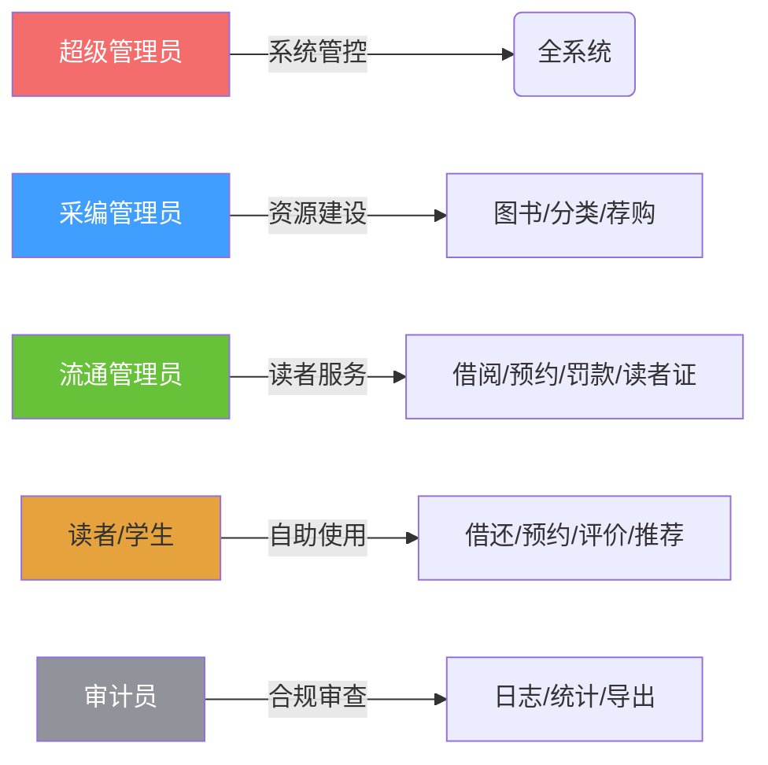
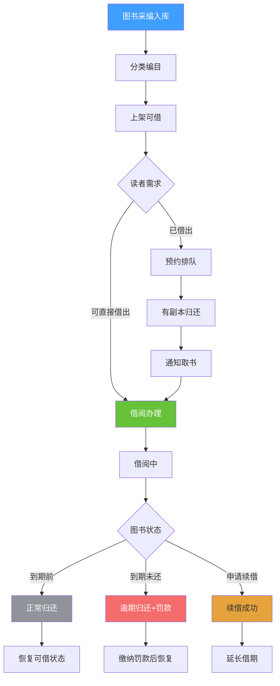

# 图书馆管理系统 - 产品需求概述

> **文档版本**: v1.0  
> **创建日期**: 2026-04-08  
> **文档状态**: 正式发布  
> **产品名称**: 图书馆管理系统 (Library Management System, LMS)  

---

## 1. 产品愿景与定位

### 1.1 产品愿景

构建一个**现代化、智能化、全流程覆盖**的图书馆管理平台，通过数字化手段提升图书馆运营效率，优化读者借阅体验，实现馆藏资源的精细化管理。

### 1.2 产品定位

| 维度 | 描述 |
|------|------|
| **目标用户** | 高校图书馆、公共图书馆、企事业单位资料室 |
| **产品形态** | B/S架构 Web 应用（前后端分离） |
| **核心价值** | 全流程闭环管理 + 数据驱动决策 + 多角色协同 |

### 1.3 核心价值主张

```
┌─────────────────────────────────────────────────────┐
│                                                     │
│   📚 馆藏管理    →  图书采编 / 分类体系 / 副本追踪     │
│   🔄 流通服务    →  借还续约 / 异地还书 / 排队机制     │
│   👥 读者服务    →  个人看板 / 智能推荐 / 评价互动     │
│   📊 数据洞察    →  运营看板 / 统计分析 / 报表导出     │
│   🔐 权限治理    →  RBAC模型 / 审计日志 / 合规追溯     │
│                                                     │
└─────────────────────────────────────────────────────┘
```

---

## 2. 目标用户画像

### 2.1 用户角色地图



### 2.2 角色详细说明

#### 🔴 超级管理员 (super_admin)
- **职责**: 系统全局管理与运维保障
- **典型场景**: 创建管理员账户、配置系统参数、角色权限分配
- **关键指标**: 系统可用性、数据完整性

#### 🔵 采编管理员 (catalog_admin)
- **职责**: 图书资源建设与组织
- **典型场景**: 图书编目入库、分类体系维护、荐购审核
- **关键指标**: 编目效率、馆藏覆盖率

#### 🟢 流通管理员 (circulation_admin)
- **职责**: 前台读者服务与流通作业
- **典型场景**: 办理借还书、处理预约排队、罚款收缴、读者证管理
- **关键指标**: 服务响应时间、周转率

#### 🟡 读者 (reader)
- **职责**: 利用图书馆资源进行学习与研究
- **典型场景**: 搜索图书、借阅归还、发表评价、查看推荐
- **关键指标**: 借阅满意度、资源利用率

#### ⚪ 审计员 (auditor)
- **职责**: 操作合规审计与数据分析
- **典型场景**: 审查操作日志、生成统计报表、异常行为监测
- **关键指标**: 审计覆盖率、报表准确度

---

## 3. 业务全景

### 3.1 核心业务流程



### 3.2 功能模块总览

| 一级模块 | 二级功能 | 优先级 | 状态 |
|----------|----------|--------|------|
| **认证中心** | 用户注册/登录、JWT令牌、密码管理 | P0 | ✅ 已完成 |
| **图书管理** | 图书CRUD、多条件搜索、副本管理、条码查询 | P0 | ✅ 已完成 |
| **借阅流通** | 单本/批量借阅、归还（支持异地）、续借 | P0 | ✅ 已完成 |
| **预约管理** | 图书预约、排队机制、取书确认、超时释放 | P0 | ✅ 已完成 |
| **罚款管理** | 逾期/损坏/丢失罚款、缴纳/免除、自动冻结 | P0 | ✅ 已完成 |
| **读者互动** | 图书评分（1-5星）、评论（含审核）、智能推荐 | P1 | ✅ 已完成 |
| **统计分析** | 运营看板、个人看板、9类统计接口、CSV导出 | P1 | ✅ 已完成 |
| **荐购管理** | 读者荐购申请、管理员审核 | P1 | ✅ 已完成 |
| **读者证** | 办理/挂失/补换、类型关联借阅参数 | P1 | ✅ 已完成 |
| **系统管理** | 分类树、节假日、系统配置、RBAC权限 | P0 | ✅ 已完成 |
| **消息通知** | 站内通知、未读计数、已读标记 | P1 | ✅ 已完成 |
| **审计日志** | 操作记录、数据快照、日志导出 | P0 | ✅ 已完成 |

---

## 4. 非功能性需求

### 4.1 技术架构约束

```
┌──────────────────────────────────────────────────────┐
│                     表现层 (Frontend)                  │
│  Vue 3 + Vite + Element Plus + ECharts + Pinia      │
├──────────────────────────────────────────────────────┤
│                     接口层 (API Gateway)               │
│  FastAPI (Swagger/OpenAPI 自动文档)                   │
├──────────────────────────────────────────────────────┤
│                     业务层 (Business)                  │
│  SQLAlchemy ORM + Pydantic 校验 + JWT 认证             │
├──────────────────────────────────────────────────────┤
│                     数据层 (Data)                      │
│  SQLite (默认) / PostgreSQL / MySQL (可切换)          │
└──────────────────────────────────────────────────────┘
```

### 4.2 关键技术指标

| 指标项 | 目标值 |
|--------|--------|
| **并发用户数** | 100+ 同时在线 |
| **API响应时间 (P95)** | < 500ms |
| **页面加载时间 (FCP)** | < 2s |
| **密码存储** | bcrypt 加密 |
| **令牌有效期** | Access: 30min / Refresh: 7天 |
| **数据库** | SQLite / PostgreSQL / MySQL |
| **前端兼容** | Chrome / Firefox / Edge (最新2版本) |

### 4.3 安全性要求

- [x] 密码复杂度校验：大小写字母 + 数字 + 特殊字符，≥8位
- [x] JWT 双令牌机制（Access Token + Refresh Token）
- [x] API 接口鉴权（Bearer Token）
- [x] RBAC 细粒度权限控制（30+ 权限点）
- [x] 操作审计日志（只增不改，含数据快照）
- [x] CORS 跨域配置白名单
- [x] SQL注入防护（ORM参数化查询）

### 4.4 可用性要求

- [x] 一键启动脚本（Windows `start.bat` / Linux `start.sh`）
- [x] Swagger API 文档自动生成 (`/api/docs`)
- [x] 前端代理配置（Vite dev proxy）
- [x] 数据库初始化脚本（建表 + 默认数据）
- [x] 种子数据导入（测试用图书数据）

---

## 5. 项目信息

### 5.1 版本规划

| 版本 | 阶段 | 核心内容 |
|------|------|----------|
| v1.0 | 当前版本 | 完整的图书管理 + 借阅流通 + 统计分析 + RBAC |
| v1.1 (规划中) | 增强版 | 邮件/短信通知、RFID集成、Excel导入导出、PDF报表 |
| v1.2 (规划中) | 智能化 | AI智能推荐、自然语言搜索、借阅预测 |

### 5.2 默认系统账户

| 角色 | 用户名 | 密码 | 说明 |
|------|--------|------|------|
| 超级管理员 | admin | Admin@123456 | 拥有所有权限 |
| 采编管理员 | catalog_admin | Catalog@123 | 图书/分类/荐购 |
| 流通管理员 | circulation_admin | Circulation@123 | 借阅/预约/罚款/读者证 |
| 读者 | reader | Reader@123 | 基础借阅功能 |

> ⚠️ **安全提示**: 生产环境部署时请立即修改默认密码！

### 5.3 快速启动

```bash
# Windows
start.bat

# Linux/Mac
chmod +x start.sh && ./start.sh
```

访问地址：
- 前端界面: http://localhost:5173  
- 后端API: http://localhost:8000  
- API文档: http://localhost:8000/api/docs  

---

*本文档由产品团队基于当前代码库分析生成，反映 v1.0 版本的完整功能范围。*
