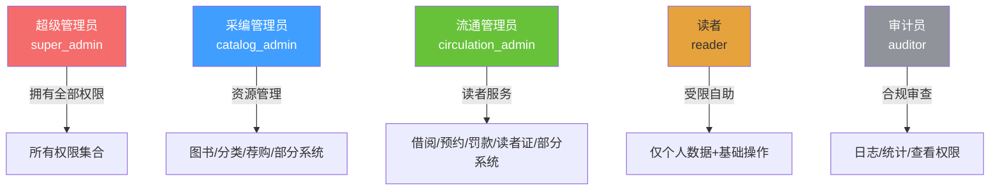

# RBAC 角色与权限模型文档

> **文档编号**: LMS-RBAC-001  
> **所属产品**: 图书馆管理系统  
> **适用版本**: v1.0  

---

## 1. 权限模型概述

本项目采用 **RBAC (Role-Based Access Control)** 模型，结合**角色枚举 + 数据库动态权限**的双重机制，实现灵活且安全的权限控制。

### 1.1 架构层次

```
┌─────────────────────────────────────────────────────────┐
│                    RBAC 权限架构                        │
│                                                         │
│  Layer 1: 角色枚举 (UserRole)                            │
│  ┌─────────┬─────────┬───────────┬───────┐           │
│  │super_  │catalog │circulation│reader │ auditor │         │
│  │admin   │_admin  │_admin    │       │         │
│  └─────────┴─────────┴───────────┴───────┘           │
│         ↓                                              │
│  Layer 2: 数据库角色表 (roles)                          │
│  ┌──────────────────────────────────────────────┐        │
│  │ role_name  │ permissions(JSON)  │ description  │        │
│  └──────────────────────────────────────────────┘        │
│         ↓                                              │
│  Layer 3: 30+ 权限点 (Permission Points)                │
│  dashboard:read / book:create / book:read / ...          │
│                                                         │
└─────────────────────────────────────────────────────────┘
```

---

## 2. 内置角色定义

| 角色编码 | 中文名称 | 英文标识 | 职责领域 |
|----------|----------|----------|----------|
| `super_admin` | 超级管理员 | Super Admin | 全局管控 |
| `catalog_admin` | 采编管理员 | Catalog Admin | 资源建设 |
| `circulation_admin` | 流通管理员 | Circulation Admin | 流通服务 |
| `reader` | 读者 | Reader | 自助服务 |
| `auditor` | 审计员 | Auditor | 合规审计 |

### 2.1 角色层级关系



---

## 3. 完整权限点清单

### 3.1 权限点总览 (共 33 个)

| 权限编码 | 权限名称 | 所属模块 | 说明 |
|----------|----------|----------|------|
| **看板与仪表盘** ||||
| `dashboard:read` | 查看看板 | Dashboard | 运营数据/个人数据 |
| **图书管理** ||||
| `book:create` | 添加图书 | Books | 新书入库 |
| `book:read` | 查看图书 | Books | 图书列表/详情 |
| `book:update` | 编辑图书 | Books | 修改图书信息 |
| `book:delete` | 删除图书 | Books | 移除图书 |
| **借阅管理** ||||
| `borrow:create` | 办理借阅 | Borrows | 借书操作 |
| `borrow:read` | 查看借阅 | Borrows | 借阅记录查询 |
| `borrow:return` | 办理归还 | Borrows | 还书操作 |
| `borrow:renew` | 办理续借 | Borrows | 续借操作 |
| `borrow:approve` | 借阅审批 | Borrows | 批量借阅等 |
| **用户管理** ||||
| `user:create` | 创建用户 | Users | 添加用户 |
| `user:read` | 查看用户 | Users | 用户列表/详情 |
| `user:update` | 编辑用户 | Users | 修改用户信息 |
| `user:delete` | 删除用户 | Users | 移除用户 |
| `user:suspend` | 停用用户 | Users | 禁用/启用 |
| **角色权限** ||||
| `role:create` | 创建角色 | Roles | 新增自定义角色 |
| `role:read` | 查看角色 | Roles | 角色列表/详情 |
| `role:update` | 编辑角色 | Roles | 修改角色权限 |
| `role:delete` | 删除角色 | Roles | 移除自定义角色 |
| **系统配置** ||||
| `config:read` | 查看配置 | SystemConfig | 读取系统参数 |
| `config:update` | 修改配置 | SystemConfig | 更新系统参数 |
| **日志审计** ||||
| `log:read` | 查看日志 | AuditLog | 审计日志查询 |
| `log:export` | 导出日志 | AuditLog | 日志CSV导出 |
| **分类管理** ||||
| `category:create` | 创建分类 | Categories | 新增分类节点 |
| `category:read` | 查看分类 | Categories | 分类树查询 |
| `category:update` | 编辑分类 | Categories | 修改分类 |
| `category:delete` | 删除分类 | Categories | 移除分类节点 |
| **预约管理** ||||
| `reservation:create` | 创建预约 | Reservations | 发起预约 |
| `reservation:read` | 查看预约 | Reservations | 预约列表 |
| `reservation:update` | 更新预约 | Reservations | 取消/取书等 |
| `reservation:cancel` | 取消预约 | Reservations | 读者主动取消 |
| **罚款管理** ||||
| `fine:read` | 查看罚款 | Fines | 罚款列表 |
| `fine:update` | 操作罚款 | Fines | 缴纳/免除 |
| **荐购管理** ||||
| `purchase:read` | 查看荐购 | PurchaseRequests | 荐购列表 |
| `purchase:review` | 审核荐购 | PurchaseRequests | 审核操作 |
| **读者证管理** ||||
| `reader_card:issue` | 办理读者证 | ReaderCard | 发放新证 |
| `reader_card:loss` | 挂失读者证 | ReaderCard | 挂失操作 |
| `reader_card:replace` | 补换读者证 | ReaderCard | 补发新证 |
| `reader_card:read` | 查看读者证 | ReaderCard | 证信息查看 |
| **统计分析** ||||
| `statistics:read` | 查看统计 | Statistics | 统计数据面板 |
| `statistics:export` | 导出报表 | Statistics | CSV报表下载 |

---

## 4. 角色权限矩阵

### 4.1 矩阵图

| 功能模块 | super_admin | catalog_admin | circulation_admin | reader | auditor |
|:-------:|:-----------:|:-------------:|:-----------------:|:------:|:-------:|
| **📊 运营看板** | ✅ | ✅ | ✅ | ✅(个人模式) | ✅ |
| **📚 图书管理** | ✅ CRUD | ✅ CRU | ❌ 只读 | ✅ 只读 | ❌ |
| **🔄 借阅管理** | ✅ 全部 | ❌ | ✅ 全部 | ✅ 自己 | ❌ |
| **📅 预约管理** | ✅ 全部 | ❌ | ✅ 全部 | ✅ 自己 | ❌ |
| **💰 罚款管理** | ✅ 全部 | ❌ | ✅ 全部 | ✅ 自己 | ❌ |
| **⭐ 评分推荐** | ✅ | ✅ | ✅ | ✅ | ❌ |
| **📈 统计分析** | ✅ 全部 | ✅ 只读 | ✅ 只读 | ❌ | ✅ 全部 |
| **👥 用户管理** | ✅ CRUD | ❌ | ❌ | ❌ | ✅ 只读 |
| **🔐 角色权限** | ✅ CRUD | ❌ | ❌ | ❌ | ❌ |
| **⚙️ 系统配置** | ✅ 全部 | ✅ 只读 | ❌ | ❌ | ✅ 只读 |
| **📂 分类管理** | ✅ CRUD | ✅ CRUD | ❌ | ✅ 只读 | ❌ |
| **📋 荐购管理** | ✅ 审核 | ✅ 审核 | ✅ 审核 | ✅ 自己 | ❌ |
| **🪪 读者证** | ❌ | ❌ | ✅ 全部 | ❌ | ❌ |
| **🔔 系统日志** | ✅ 全部 | ✅ 只读 | ✅ 只读 | ❌ | ✅ 全部+导出 |

> 图例: **✅** 有权限 / **❌** 无权限 / **CRUD** 增删改查 / **RU** 只读/更新

### 4.2 权限矩阵可视化

```mermaid
graph LR
    subgraph 超级管理员["超级管理员 super_admin"]
        D1[dashboard:read]
        B1[book:create]
        B2[book:read]
        B3[book:update]
        B4[book:delete]
        BW1[borrow:create ~ borrow:approve]
        U1[user:create ~ user:suspend]
        R1[role:create ~ role:delete]
        SC[config:read ~ config:update]
        L[log:read ~ log:export]
        CT[category:*]
        RS[*]
        F[fine:read ~ fine:update]
        PC[purchase:*]
        RC[reader_card:*]
        ST[*]
    end

    subgraph 采编管理员["采编管理员 catalog_admin"]
        D1
        B1 ~ B3
        CT
        PC
        ST_read[statistics:read]
        SC_read[config:read]
        L_read[log:read]
    end

    subgraph 流通管理员["流通管理员 circulation_admin"]
        D1
        BW1
        RS
        F
        RC
        ST_read
        SC_read
        L_read
        U_read[user:read]
    end

    subgraph 读者["读者 reader"]
        B2
        CT_read[category:read]
        RS_own[reservation:own]
        F_own[fine:own]
        ST_read
    end

    subgraph 审计员["审计员 auditor"]
        D1
        U_read
        BW_read[borrow:read]
        F_read
        ST_full[statistics:full]
        SC_read
        L_full[log:full + log:export]
    end
```

---

## 5. 默认权限分配

### 5.1 超级管理员 (super_admin)

```json
["全部33个权限"]
```

> 拥有系统所有权限，不可限制

### 5.2 采编管理员 (catalog_admin)

```json
[
  "dashboard:read",
  "book:create", "book:read", "book:update", "book:delete",
  "category:create", "category:read", "category:update", "category:delete",
  "config:read", "log:read",
  "purchase:read", "purchase:review",
  "statistics:read"
]
```

**权限说明**: 负责图书资源的全生命周期管理和分类体系建设，可审核荐购，可查看统计数据和系统日志。

### 5.3 流通管理员 (circulation_admin)

```json
[
  "dashboard:read",
  "borrow:create", "borrow:read", "borrow:return", "borrow:renew", "borrow:approve",
  "user:read",
  "reservation:create", "reservation:read", "reservation:update", "reservation:cancel",
  "fine:read", "fine:update",
  "log:read",
  "reader_card:issue", "reader_card:loss", "reader_card:replace", "reader_card:read",
  "statistics:read"
]
```

**权限说明**: 负责前台读者服务的全流程操作，包括借还书、预约排队、罚款处理和读者证管理。

### 5.4 读者 (reader)

```json
[
  "book:read",
  "category:read",
  "borrow:read",
  "reservation:create", "reservation:read", "reservation:cancel"
]
```

**权限说明**: 仅能查看图书和分类信息、操作自己的借阅和预约记录，无法看到其他读者的敏感数据。

### 5.5 审计员 (auditor)

```json
[
  "dashboard:read",
  "log:read", "log:export",
  "user:read", "borrow:read", "fine:read",
  "config:read",
  "statistics:read", "statistics:export"
]
```

**权限说明**: 专注于合规审计工作，可查看所有日志和统计数据并导出报表，但无任何写操作权限，确保审计独立性。

---

## 6. 权限校验机制

### 6.1 后端权限校验三层防线

```
┌──────────────────────────────────────────────────────┐
│  Layer 1: 路由级角色检查                              │
│  ┌────────────────────────────────────────┐           │
│  │ require_super_admin()                 │ ← 硬编码角色 │
│  │ require_circulation_admin()         │           │
│  │ require_auditor()                   │           │
│  └────────────────────────────────────────┘           │
├──────────────────────────────────────────────────────┤
│  Layer 2: 细粒度权限点检查                           │
│  ┌────────────────────────────────────────┐           │
│  │ require_permission('book:create',       │ ← 动态权限点   │
│ │                 'book:update')        │           │
│  └────────────────────────────────────────┘           │
├──────────────────────────────────────────────────────┤
│  Layer 3: 数据级所有权过滤                             │
│  ┌────────────────────────────────────────┐           │
│  │ if current_user.id != borrower.user_id: │ ← 数据归属     │
│  │     raise 403                       │           │
│  └────────────────────────────────────────┘           │
└──────────────────────────────────────────────────────┘
```

### 6.2 权限检查依赖注入示例

```python
# books.py - 图书删除接口（需要采编管理员权限）
@router.delete("/{book_id}")
async def delete_book(
    book_id: int,
    current_user: User = Depends(require_catalog_admin),  # Layer 1: 角色检查
    db: Session = Depends(get_db)
):
    # ... 删除逻辑 ...
```

```python
# roles.py - 创建角色（需要超级管理员权限）
@router.post("")
async def create_role(
    role_data: RoleCreate,
    current_user: User = Depend(super_admin),  # Layer 1: 角色硬编码
    db: Session = Depends(get_db)
):
    # ... 角色创建逻辑 ...
```

### 6.3 前端权限控制

**路由级别**:
```javascript
// router/index.js - 路由守卫
{
  path: 'statistics',
  meta: { roles: ['super_admin', 'catalog_admin', 'circulation_admin', 'auditor'] }
}
```

**组件/元素级别**:
```vue
<!-- MainLayout.vue - 菜单项显隐 -->
<el-menu-item index="/system/users" v-if="isSuperAdmin">
<el-button v-permission="'book:create'">添加图书</el-button>
```

**指令用法**:
```vue
<!-- 单权限 -->
<div v-permission="'book:create'">仅管理员可见</div>

<!-- 多权限（任一满足） -->
<div v-permission="['book:create', 'book:update']">管理员</div>

<!-- 多权限（必须全部满足） -->
<div v-permission.all="['book:create', 'book:delete']">高级管理员</div>
```

---

## 7. 自定义角色扩展

### 7.1 创建自定义角色

超级管理员可以创建除5个内置角色之外的自定义角色，并为它们分配任意的权限组合。

**内置角色保护**:
```python
builtin_roles = {"super_admin", "catalog_admin", "circulation_admin", "reader", "auditor"}
# 这些角色不允许被删除
```

**删除前提**:
```python
# 必须确保没有用户在使用该角色
users_count = db.query(User).filter(User.role == UserRole(role.role_name)).count()
if users_count > 0:
    raise HTTPException(status_code=400, detail=f"仍有 {users_count} 名用户使用此角色")
```

### 7.2 权限同步初始化

系统提供一键初始化接口，将硬编码的角色权限映射同步到数据库：

```
POST /api/v1/roles/init/default-roles
→ 将 DEFAULT_ROLE_PERMISSIONS 字典写入 roles 表
→ 已存在的角色执行 update，不存在的执行 create
→ 返回 created/updated 数量统计
```

---

*本文档定义了系统的完整 RBAC 权限模型，是开发和测试人员进行权限控制的权威参考。*
