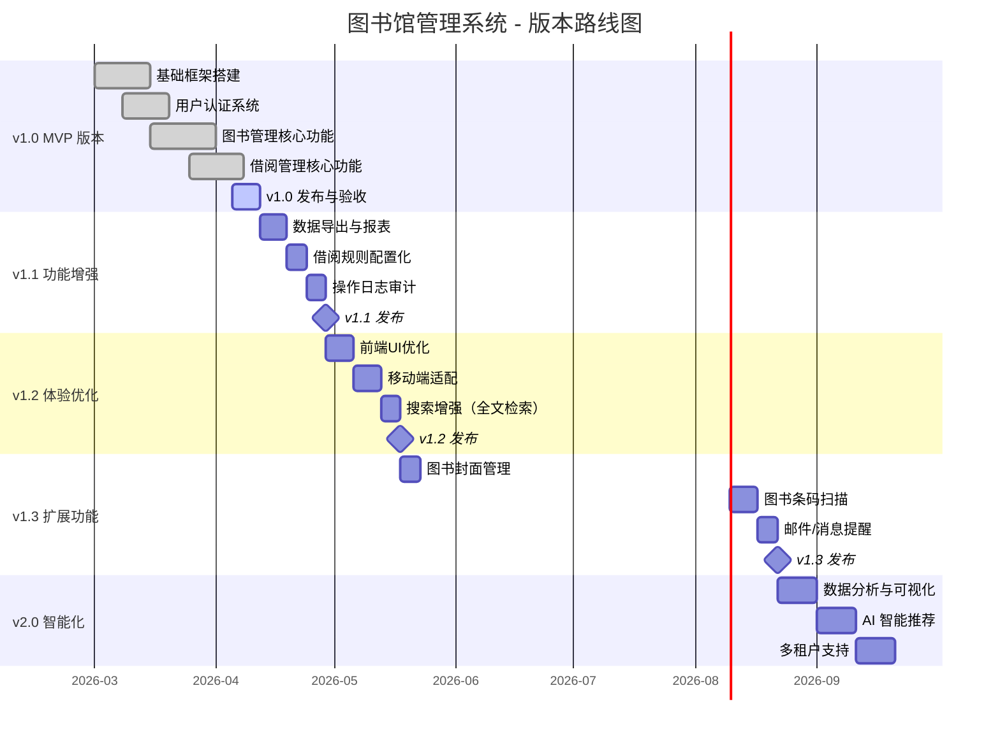

# 产品路线图与版本规划

> **文档版本**：v1.0  
> **更新日期**：2026-04-08  
> **项目名称**：图书馆管理系统  

---

## 1. 产品愿景与战略定位

### 1.1 产品愿景

> 打造一款**简洁高效、功能完善**的现代化图书馆管理系统，为中小型图书馆、学校图书室、企业阅览室提供**开箱即用**的数字化解决方案。

### 1.2 战略目标

| 阶段 | 时间周期 | 核心目标 | 关键成果 |
|------|----------|----------|----------|
| **MVP 阶段** | v1.0 | 完成基础闭环 | 核心借还流程可用 |
| **成长阶段** | v1.1 - v1.3 | 功能完善 | 管理能力增强 |
| **成熟阶段** | v2.0+ | 智能化升级 | AI 推荐、数据分析 |

### 1.3 目标用户群体

| 用户群 | 特征描述 | 核心诉求 |
|--------|----------|----------|
| **学校图书室** | 中小学、高校院系图书室 | 简单易上手、低成本 |
| **企业阅览室** | 公司内部图书/资料管理 | 权限清晰、借还追踪 |
| **社区图书馆** | 小型公共图书馆 | 稳定可靠、多终端支持 |
| **个人藏书管理** | 个人藏书爱好者 | 轻量化、快速部署 |

---

## 2. 版本规划总览



---

## 3. v1.0 - MVP 版本（已完成）

### 3.1 版本概述

**版本代号**：Foundation  
**发布日期**：2026-04-08（预计）  
**版本状态**：✅ 已完成开发，待最终验收

### 3.2 核心功能清单

| 模块 | 功能点 | 状态 | 说明 |
|------|--------|------|------|
| **用户认证** | 用户注册 | ✅ | 用户名/邮箱/手机号注册 |
| | 用户登录 | ✅ | 用户名+密码登录 |
| | Token 认证 | ✅ | JWT Token 身份验证 |
| | 退出登录 | ✅ | Token 清除与销毁 |
| **图书管理** | 图书列表 | ✅ | 分页、排序、筛选 |
| | 新增图书 | ✅ | 完整表单校验 |
| | 编辑图书 | ✅ | 修改图书信息 |
| | 删除图书 | ✅ | 单删+批量删除 |
| | 图书搜索 | ✅ | 多条件组合查询 |
| | 分类管理 | ✅ | 图书分类 CRUD |
| **借阅管理** | 图书借阅 | ✅ | 库存检查、限额校验 |
| | 图书归还 | ✅ | 自动计算逾期 |
| | 续借管理 | ✅ | 续借次数限制 |
| | 借阅记录 | ✅ | 历史记录查看 |
| | 我的借阅 | ✅ | 个人借阅状态 |
| **系统管理** | 用户管理 | ✅ | 管理员专属功能 |
| | RBAC 权限 | ✅ | admin/user 双角色 |
| | 仪表盘 | ✅ | 数据概览面板 |
| **数据管理** | Excel 导出 | ✅ | 图书/借阅数据导出 |
| | 数据初始化 | ✅ | 种子数据填充 |

### 3.3 技术栈

| 层级 | 技术 | 版本 | 说明 |
|------|------|------|------|
| **前端** | Vue.js | 3.x | 渐进式前端框架 |
| | Element Plus | 2.x | UI 组件库 |
| | Vue Router | 4.x | 路由管理 |
| | Pinia | 2.x | 状态管理 |
| | Axios | 1.x | HTTP 请求库 |
| **后端** | Python | 3.10+ | 运行时 |
| | FastAPI | 0.104+ | Web 框架 |
| | SQLAlchemy | 2.x | ORM 框架 |
| | JWT | - | Token 认证 |
| | Pydantic | 2.x | 数据校验 |
| **数据库** | SQLite | 3.x | 开发环境 |
| **部署** | Docker | - | 容器化部署 |

### 3.4 已知限制

| 编号 | 限制 | 影响 | 计划修复版本 |
|------|------|------|-------------|
| LIM-001 | 无全文检索引擎 | 搜索效率较低 | v1.2 |
| LIM-002 | 无邮件通知 | 逾期无法主动提醒 | v1.3 |
| LIM-003 | 无图书封面上传 | 视觉体验一般 | v1.3 |
| LIM-004 | 单一数据库实例 | 不支持多机构隔离 | v2.0 |
| LIM-005 | 无操作审计日志 | 问题追溯困难 | v1.1 |

---

## 4. v1.1 - 功能增强版（计划中）

### 4.1 版本概述

**版本代号**：Enhancement  
**计划发布**：2026-05-01（预估）  
**开发周期**：约 2-3 周

### 4.2 功能规划

#### Feature 1: 数据导出与报表增强

**优先级**：P1 - 高  
**预估工作量**：3 人日

| 功能点 | 详细描述 | 验收标准 |
|--------|----------|----------|
| 借阅报表导出 | 按时间段导出借阅统计数据 | 支持 CSV/XLSX/PDF 格式 |
| 自定义报表 | 用户可选择导出字段 | 至少支持 10+ 字段选择 |
| 定时报表 | 定期生成月度/季度报告 | 支持 cron 表达式配置 |
| 打印功能 | 借阅单、收据打印 | 格式美观、支持自定义模板 |

#### Feature 2: 借阅规则配置化

**优先级**：P1 - 高  
**预估工作量**：3 人日

| 功能点 | 详细描述 | 验收标准 |
|--------|----------|----------|
| 最大借阅数配置 | 管理员可设置每用户最大借阅数 | 默认 5 本，可配置 1-20 |
| 最长借阅天数配置 | 设置默认借阅期限 | 默认 30 天，可配置 7-90 天 |
| 最大续借次数配置 | 设置允许续借的最大次数 | 默认 2 次，可配置 0-5 次 |
| 逾期罚款配置 | 逾期费率设置（元/天） | 可配置 0-10 元/天 |
| 用户分级规则 | 不同角色不同限额 | 学生/教师/员工差异化配置 |

**数据模型变更**：

```python
# 新增：借阅规则配置表
class BorrowRule(Base):
    __tablename__ = "borrow_rules"
    
    id = Column(Integer, primary_key=True)
    rule_name = Column(String(50))          # 规则名称
    max_books = Column(Integer, default=5)   # 最大借阅数
    max_days = Column(Integer, default=30)   # 最大借阅天数
    max_renewals = Column(Integer, default=2) # 最大续借次数
    overdue_fee_per_day = Column(Float, default=0.1) # 逾期日费率
    applicable_role = Column(String(20))    # 适用角色
    is_active = Column(Boolean, default=True)
    created_at = Column(DateTime)
    updated_at = Column(DateTime)
```

#### Feature 3: 操作日志审计

**优先级**：P1 - 高  
**预估工作量**：4 人日

| 功能点 | 详细描述 | 验收标准 |
|--------|----------|----------|
| 操作日志记录 | 自动记录关键操作 | 包含操作人、时间、类型、内容 |
| 日志查看 | 管理员可查看操作日志 | 支持筛选和搜索 |
| 日志导出 | 日志数据可导出 | 支持按时间段导出 |
| 日志防篡改 | 日志记录不可修改 | 只有追加，无更新/删除 |

**数据模型变更**：

```python
# 新增：操作日志表
class OperationLog(Base):
    __tablename__ = "operation_logs"
    
    id = Column(BigInteger, primary_key=True)
    user_id = Column(Integer, ForeignKey("users.id"))
    username = Column(String(50))           # 冗余存储，避免联表
    action = Column(String(20))             # CREATE/UPDATE/DELETE/LOGIN/EXPORT
    target_type = Column(String(30))        # book/user/borrow/category/rule
    target_id = Column(Integer)             # 目标对象 ID
    detail = Column(Text)                   # 操作详情（JSON 格式）
    ip_address =Column(String(45))          # 操作 IP
    user_agent = Column(String(255))        # 客户端 UA
    created_at = Column(DateTime, default=datetime.utcnow)
    
    # 索引
    idx_user_id = Index("idx_log_user", user_id)
    idx_action = Index("idx_log_action", action)
    idx_created = Index("idx_log_created", created_at)
```

### 4.3 v1.1 验收标准

- [ ] 所有新增功能通过测试用例验证
- [ ] 操作日志覆盖 100% 的敏感操作
- [ ] 借阅规则修改即时生效
- [ ] 向下兼容 v1.0 数据库（自动迁移）
- [ ] 无已知 P0/P1 级 Bug

---

## 5. v1.2 - 体验优化版（计划中）

### 5.1 版本概述

**版本代号**：Experience  
**计划发布**：2026-06-01（预估）  
**开发周期**：约 3 周

### 5.2 功能规划

#### Feature 1: 前端 UI/UX 升级

**优先级**：P1 - 高  
**预估工作量**：5 人日

| 优化项 | 详细描述 | 目标指标 |
|--------|----------|----------|
| 视觉重构 | 更现代的配色方案和视觉风格 | UI 一致性 100% |
| 骨架屏 | 列表/详情页加载骨架屏 | 替代传统 Loading |
| 虚拟滚动 | 大数据量列表虚拟滚动 | 万级数据流畅滚动 |
| 暗色模式 | 支持亮色/暗色主题切换 | 减少眼疲劳 |
| 国际化(i18n) | 支持中文/英文切换 | 至少 2 种语言 |
| 键盘快捷键 | 常用操作的快捷键支持 | 提升 30% 操作效率 |

#### Feature 2: 移动端适配

**优先级**：P1 - 高  
**预估工作量**：5 人日

| 优化项 | 详细描述 | 目标指标 |
|--------|----------|----------|
| 响应式布局 | 适配手机和平板设备 | 320px - 1920px 全覆盖 |
| 移动端导航 | 底部 Tab 导航替代侧边栏 | 符合移动端交互习惯 |
| 触控优化 | 按钮尺寸、手势操作适配 | 触控目标 ≥ 44px |
| PWA 支持 | 支持添加到主屏幕 | 可离线浏览部分页面 |

#### Feature 3: 搜索增强

**优先级**：P2 - 中  
**预估工作量**：4 人日

| 功能点 | 详细描述 |
|--------|----------|
| 全文检索 | 基于 MeiliSearch/Elasticsearch 的全文搜索 |
| 搜索建议 | 输入时实时联想推荐 |
| 搜索历史 | 记录用户搜索历史 |
| 高级筛选 | 多维度组合筛选（分类+出版年+价格区间+状态） |
| 搜索结果高亮 | 关键词命中高亮显示 |

### 5.3 v1.2 验收标准

- [ ] 移动端主流机型适配通过
- [ ] Google Lighthouse 性能评分 ≥ 85
- [ ] 暗色模式完整覆盖所有页面
- [ ] 全文搜索响应时间 < 500ms

---

## 6. v1.3 - 扩展功能版（计划中）

### 6.1 版本概述

**版本代号**：Extension  
**计划发布**：2026-07-01（预估）  
**开发周期**：约 2-3 周

### 6.2 功能规划

#### Feature 1: 图书封面管理

**优先级**：P2 - 中  
**预估工作量**：3 人日

| 功能点 | 详细描述 |
|--------|----------|
| 封面上传 | 支持上传图书封面图片（JPG/PNG/WebP） |
| 封面裁剪 | 上传后在线裁剪和压缩 |
| 封面展示 | 列表缩略图 + 详情大图 |
| 封面缓存 | CDN 缓存加速封面加载 |
| 批量导入 | 根据 ISBN 自动获取封面（调用第三方 API） |

#### Feature 2: 图书条码/二维码

**优先级**：P2 - 中  
**预估工作量**：5 人日

| 功能点 | 详细描述 |
|--------|----------|
| 条码生成 | 为每本图书生成唯一条形码（Code128/ISBN） |
| 二维码生成 | 生成图书信息二维码 |
| 扫描借还 | 通过扫码枪/摄像头扫码快速借还 |
| 批量入库 | 扫描条码批量录入新书 |
| 打印标签 | 打印图书标签贴纸 |

#### Feature 3: 消息通知系统

**优先级**：P1 - 高  
**预估工作量**：5 人日

| 功能点 | 详细描述 |
|--------|----------|
| 到期提醒 | 借阅到期前 N 天发送提醒 |
| 逾期通知 | 逾期后每日/每周通知 |
| 新书上架 | 新书入库时通知关注用户 |
| 归还确认 | 归还成功后发送确认通知 |
| 通知渠道 | 系统内通知 + 邮件 + 微信/短信（可选） |

**通知数据模型**：

```python
class Notification(Base):
    __tablename__ = "notifications"
    
    id = Column(BigInteger, primary_key=True)
    user_id = Column(Integer, ForeignKey("users.id"))
    type = Column(String(20))              # due_soon/overdue/new_book/return_confirm
    title = Column(String(100))
    content = Column(Text)
    is_read = Column(Boolean, default=False)
    channel = Column(String(20), default="system")  # system/email/sms/wechat
    sent_at = Column(DateTime)             # 发送时间
    read_at = Column(DateTime)             # 阅读时间
    created_at = Column(DateTime, default=datetime.utcnow)
```

### 6.3 v1.3 验收标准

- [ ] 封面上传支持 JPG/PNG/WebP，单张 ≤ 5MB
- [ ] 扫码借还操作 ≤ 3 秒完成
- [ ] 到期提醒准确率 100%
- [ ] 通知送达率 ≥ 98%

---

## 7. v2.0 - 智能化版本（远期规划）

### 7.1 版本概述

**版本代号**：Intelligence  
**计划发布**：2026-Q3/Q4（预估）

### 7.2 功能规划

#### Feature 1: 数据分析与可视化

| 功能点 | 详细描述 |
|--------|----------|
| 借阅趋势分析 | 日/周/月/年借阅量趋势图 |
| 热门图书排行 | Top 10/20/50 借阅排行榜 |
| 读者画像分析 | 读者阅读偏好、活跃度分析 |
| 图书流转分析 | 图书流通率、滞留预警 |
| 自定义报表 | 拖拽式报表构建器 |
| 数据大屏 | 实时运营数据大屏展示 |

#### Feature 2: AI 智能推荐

| 功能点 | 详细描述 |
|--------|----------|
| 个性化推荐 | 基于借阅历史的协同过滤推荐 |
| 相似图书推荐 | 基于图书内容的相似度推荐 |
| 智能搜索 | 自然语言搜索理解 |
| 阅读兴趣预测 | 预测读者可能感兴趣的图书 |
| 智能问答 | 关于馆藏信息的智能客服 |

#### Feature 3: 多租户/多机构支持

| 功能点 | 详细描述 |
|--------|----------|
| 多机构隔离 | 数据按机构完全隔离 |
| 机构独立配置 | 每个机构独立的规则和设置 |
| 超级管理员 | 平台级别的管理和监控 |
| 数据迁移 | 支持单机版数据迁移到多租户版 |

---

## 8. 技术债务清单

### 8.1 当前技术债务

| 编号 | 描述 | 严重程度 | 建议修复版本 | 工作量估算 |
|------|------|----------|-------------|-----------|
| TD-001 | 前端缺少单元测试 | 中 | v1.1 | 3 人日 |
| TD-002 | 后端 API 缺少 Swagger 完整注解 | 低 | v1.1 | 1 人日 |
| TD-003 | 数据库缺少索引优化 | 中 | v1.1 | 1 人日 |
| TD-004 | 前端状态管理可进一步优化 | 低 | v1.2 | 2 人日 |
| TD-005 | 缺少 CI/CD 流水线 | 高 | v1.1 | 3 人日 |
| TD-006 | 错误处理不够统一 | 中 | v1.1 | 2 人日 |
| TD-007 | 缺少完善的日志系统 | 中 | v1.1 | 2 人日 |

### 8.2 技术改进计划

```
v1.1 期间技术改进：
├── 建立 CI/CD 流水线（GitHub Actions）
├── 补充核心模块单元测试（覆盖率目标 60%）
├── 完善错误码体系和统一错误处理
├── 补充数据库索引
└── 完善 API 文档

v1.2 期间技术改进：
├── 引入代码质量检查工具（ESLint + Prettier）
├── 单元测试覆盖率提升至 80%
├── 引入 E2E 测试（Playwright）
└── 性能基准测试建立
```

---

## 9. 里程碑节点

| 里程碑 | 计划日期 | 关键交付物 | 验收标准 |
|--------|----------|-----------|----------|
| **M1: MVP 完成** | 2026-04-12 | v1.0 正式版 | 核心借还流程可用 |
| **M2: 功能完善** | 2026-05-06 | v1.1 版本 | 报表+规则+审计 |
| **M3: 体验升级** | 2026-06-10 | v1.2 版本 | 移动端+暗色模式 |
| **M4: 能力扩展** | 2026-07-08 | v1.3 版本 | 扫码+通知 |
| **M5: 智能化** | 2026-Q4 | v2.0 版本 | AI 推荐+数据分析 |

---

## 10. 风险评估与应对

| 风险 | 可能性 | 影响 | 应对措施 |
|------|--------|------|----------|
| 需求蔓延 | 高 | 中 | 严格版本边界，超出范围纳入下一版本 |
| 技术选型不当 | 低 | 高 | 充分的技术调研和 PoC 验证 |
| 人员变动 | 中 | 中 | 知识沉淀、代码规范、文档完善 |
| 第三方服务依赖 | 中 | 低 | 设计 fallback 方案，降低耦合 |
| 性能瓶颈 | 中 | 中 | 及早做压力测试，预留优化空间 |
| 安全漏洞 | 低 | 高 | 定期安全审查，依赖扫描 |

---

*文档结束*
