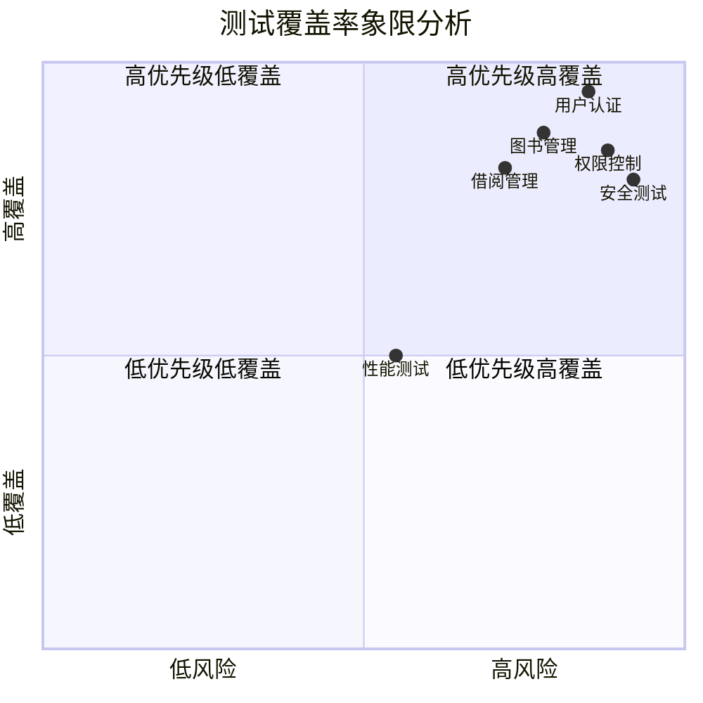

# 测试用例文档

> **文档版本**：v1.0  
> **更新日期**：2026-04-08  
> **测试范围**：图书馆管理系统全功能测试  

---

## 1. 测试概述

### 1.1 测试目标

确保图书馆管理系统各功能模块的正确性、稳定性和用户体验质量。

### 1.2 测试范围

| 模块 | 测试重点 | 优先级 |
|------|----------|--------|
| 用户认证模块 | 登录、注册、Token 管理 | P0 - 最高 |
| 图书管理模块 | CRUD、搜索、导入导出 | P0 - 最高 |
| 借阅管理模块 | 借阅、归还、续借、逾期 | P0 - 最高 |
| 权限控制模块 | RBAC 权限校验 | P0 - 最高 |
| 用户管理模块（管理员）| 用户CRUD、角色分配 | P1 - 高 |
| 个人信息管理 | 修改资料、改密 | P1 - 高 |
| 数据导出模块 | Excel 导出 | P2 - 中 |

### 1.3 测试环境

| 项目 | 说明 |
|------|------|
| 前端框架 | Vue 3 + Element Plus |
| 后端框架 | Python FastAPI |
| 数据库 | SQLite / MySQL |
| 浏览器 | Chrome 120+, Firefox 120+, Edge 120+ |
| 测试工具 | Pytest (后端) / Vitest (前端) |

---

## 2. 用户认证模块测试

### 2.1 用户注册

| 用例ID | TC-AUTH-001 | 用例名称 | 正常注册新用户 |
|--------|-------------|----------|----------------|
| **前置条件** | 未登录状态，数据库中无该用户名 |
| **优先级** | P0 |
| **测试步骤** | 1. 打开注册页面 2. 输入合法的用户名（如 testuser001） 3. 输入合法的邮箱（如 test@example.com） 4. 输入合法的手机号（如 13800138000） 5. 输入符合规则的密码（Test123456） 6. 再次输入确认密码 7. 点击"注册"按钮 |
| **预期结果** | 1. 注册成功，跳转到登录页或自动登录 2. 显示成功提示消息 3. 数据库中新增对应用户记录 |

| 用例ID | TC-AUTH-002 | 用例名称 | 用户名重复注册 |
|--------|-------------|----------|----------------|
| **前置条件** | 数据库中已存在用户名 admin |
| **优先级** | P0 |
| **测试步骤** | 1. 在注册页面输入已存在的用户名 admin 2. 填写其他合法信息 3. 点击"注册"按钮 |
| **预期结果** | 1. 显示"用户名已存在"的错误提示 2. 注册失败，停留在注册页面 3. 不创建新记录 |

| 用例ID | TC-AUTH-003 | 用例名称 | 密码不符合规则 |
|--------|-------------|----------|----------------|
| **前置条件** | 无 |
| **优先级** | P0 |
| **测试步骤** | 1. 输入弱密码（如 123456 或 abcdefg） 2. 其他字段填写合法 3. 点击"注册"按钮 |
| **预期结果** | 1. 密码输入框下方显示错误提示："密码需要包含字母和数字" 2. 注册按钮保持禁用或提交后被拦截 |

| 用例ID | TC-AUTH-004 | 用例名称 | 必填字段为空 |
|--------|-------------|----------|----------------|
| **前置条件** | 无 |
| **优先级** | P0 |
| **测试步骤** | 1. 留空任意一个必填字段 2. 直接点击"注册"按钮 |
| **预期结果** | 1. 所有空的必填字段显示红色边框 2. 对应字段下方显示"此字段为必填项"提示 |

| 用例ID | TC-AUTH-005 | 用例名称 | 两次密码不一致 |
|--------|-------------|----------|----------------|
| **前置条件** | 无 |
| **优先级** | P1 |
| **测试步骤** | 1. 密码输入 Test123456 2. 确认密码输入 654321test 3. 点击"注册"按钮 |
| **预期结果** | 1. 确认密码字段显示错误提示："两次输入的密码不一致" |

### 2.2 用户登录

| 用例ID | TC-AUTH-010 | 用例名称 | 正确凭证登录 |
|--------|-------------|----------|----------------|
| **前置条件** | 已注册用户 admin / Admin@123 |
| **优先级** | P0 |
| **测试步骤** | 1. 打开登录页面 2. 输入正确的用户名 admin 3. 输入正确的密码 Admin@123 4. 点击"登录"按钮 |
| **预期结果** | 1. 登录成功，跳转到首页/仪表盘 2. 页面顶部显示用户信息和头像 3. 本地存储 Token（localStorage/Cookie） |

| 用例ID | TC-AUTH-011 | 用例名称 | 错误密码登录 |
|--------|-------------|----------|----------------|
| **前置条件** | 已注册用户 admin |
| **优先级** | P0 |
| **测试步骤** | 1. 输入正确的用户名 admin 2. 输入错误的密码 wrongpassword 3. 点击"登录"按钮 |
| **预期结果** | 1. 显示"用户名或密码错误"的错误提示 2. 停留在登录页面 3. 不产生有效 Token |

| 用例ID | TC-AUTH-012 | 用例名称 | 不存在的用户登录 |
|--------|-------------|----------|----------------|
| **前置条件** | 无 |
| **优先级** | P1 |
| **测试步骤** | 1. 输入不存在的用户名 nonexistent_user 2. 输入任意密码 3. 点击"登录"按钮 |
| **预期结果** | 1. 显示"用户名或密码错误"的通用错误提示（不泄露用户是否存在的信息） |

| 用例ID | TC-AUTH-013 | 用例名称 | 空字段登录 |
|--------|-------------|----------|----------------|
| **前置条件** | 无 |
| **优先级** | P1 |
| **测试步骤** | 1. 用户名为空，直接点击"登录" |
| **预期结果** | 1. 用户名输入框获得焦点并显示必填提示 |

| 用例ID | TC-AUTH-014 | 用例名称 | 回车键登录 |
|--------|-------------|----------|----------------|
| **前置条件** | 已注册用户 |
| **优先级** | P2 |
| **测试步骤** | 1. 输入正确的用户名和密码 2. 在密码框中按 Enter 键 |
| **预期结果** | 1. 触发登录操作，等同于点击登录按钮 |

| 用例ID | TC-AUTH-015 | 用例名称 | 记住密码功能 |
|--------|-------------|----------|----------------|
| **前置条件** | 已注册用户 |
| **优先级** | P2 |
| **测试步骤** | 1. 勾选"记住密码"选项 2. 输入凭证并登录成功 3. 关闭浏览器重新打开登录页 |
| **预期结果** | 1. 用户名和密码字段被自动填充 2. Token 有效期内无需重新登录 |

### 2.3 登录验证码 ⭐ 新增

| 用例ID | TC-AUTH-016 | 用例名称 | 正常获取验证码 |
|--------|-------------|----------|----------------|
| **前置条件** | 后端服务正常运行 |
| **优先级** | P0 |
| **测试步骤** | 1. 打开登录页面（自动触发） 2. 或调用 GET /api/v1/auth/captcha |
| **预期结果** | 1. 返回 captcha_key 和 captcha_image(base64) 2. 图片正常显示（含干扰线和干扰点） 3. expire_in = 300 秒 4. captcha_key 为 32 位十六进制字符串 |

| 用例ID | TC-AUTH-017 | 用例名称 | 正确输入验证码登录 |
|--------|-------------|----------|----------------|
| **前置条件** | 已获取有效验证码，已知正确验证码文本 |
| **优先级** | P0 |
| **测试步骤** | 1. 获取验证码，记录 captcha_key 和图片中的文本 2. 在登录表单输入正确的用户名、密码、验证码 3. 提交登录 |
| **预期结果** | 1. 登录成功，返回 access_token 和 refresh_token 2. 该验证码 key 已被消耗，再次使用同一 key 校验应失败 |

| 用例ID | TC-AUTH-018 | 用例名称 | 错误的验证码登录 |
|--------|-------------|----------|----------------|
| **前置条件** | 已获取有效验证码 |
| **优先级** | P0 |
| **测试步骤** | 1. 获取验证码 2. 故意输入错误的验证码（如输入 "XXXX"） 3. 提交登录 |
| **预期结果** | 1. 返回 HTTP 400 错误："验证码错误或已过期，请重新获取" 2. 不返回任何 token 信息 3. 前端自动刷新验证码 |

| 用例ID | TC-AUTH-019 | 用例名称 | 验证码大小写不敏感 |
|--------|-------------|----------|----------------|
| **前置条件** | 已获取验证码（假设正确值为 "A7Xk"） |
| **优先级** | P1 |
| **测试步骤** | 1. 使用小写 "a7xk" 作为验证码提交登录 |
| **预期结果** | 1. 验证码校验通过（大小写不敏感） 2. 继续走后续密码验证流程 |

| 用例ID | TC-AUTH-020 | 用例名称 | 验证码过期后使用 |
|--------|-------------|----------|----------------|
| **前置条件** | 已获取验证码 |
| **优先级** | P1 |
| **测试步骤** | 1. 获取验证码 2. 等待超过 5 分钟（或模拟时间过期） 3. 使用该验证码提交登录 |
| **预期结果** | 1. 返回 400 错误：验证码已过期 2. 服务端自动清理过期数据 |

| 用例ID | TC-AUTH-021 | 用例名称 | 验证码一次性使用 |
|--------|-------------|----------|----------------|
| **前置条件** | 已获取有效验证码且已成功使用过一次 |
| **优先级** | P1 |
| **测试步骤** | 1. 使用某 captcha_key 成功通过验证码校验 2. 再次使用相同的 captcha_key 和验证码文本进行校验 |
| **预期结果** | 1. 第二次校验失败（验证码已被标记为 used） 2. 返回错误提示 |

| 用例ID | TC-AUTH-022 | 用例名称 | 刷新验证码 |
|--------|-------------|----------|----------------|
| **前置条件** | 登录页面已打开 |
| **优先级** | P2 |
| **测试步骤** | 1. 当前显示一张验证码图片 A 2. 点击验证码图片区域 3. 或点击"换一个"链接 |
| **预期结果** | 1. 验证码图片更新为新的图片 B（与 A 不同） 2. captcha_key 更新为新值 3. 验证码输入框被清空 |

| 用例ID | TC-AUTH-023 | 用例名称 | 登录失败后自动刷新验证码 |
|--------|-------------|----------|----------------|
| **前置条件** | 已获取验证码 |
| **优先级** | P1 |
| **测试步骤** | 1. 输入正确的验证码但错误的密码 2. 提交登录（触发密码错误 401） |
| **预期结果** | 1. 登录失败提示"用户名或密码错误" 2. 验证码图片自动刷新为新的验证码 3. 验证码输入框内容被清空 |

| 用例ID | TC-AUTH-024 | 用例名称 | 不传验证码登录（兼容性降级） |
|--------|-------------|----------|----------------|
| **前置条件** | 无 |
| **优先级** | P2 |
| **测试步骤** | 1. 登录请求中不包含 captchaKey 和 captchaCode 字段 2. 仅发送 username + password |
| **预期结果** | 1. 跳过验证码校验步骤（兼容性设计） 2. 继续进行用户名密码验证 3. *后续版本可能强制要求验证码* |

### 2.4 退出登录

| 用例ID | TC-AUTH-030 | 用例名称 | 正常退出 |
|--------|-------------|----------|----------------|
| **前置条件** | 用户处于登录状态 |
| **优先级** | P0 |
| **测试步骤** | 1. 点击右上角用户头像下拉菜单 2. 选择"退出登录" |
| **预期结果** | 1. 清除本地存储的 Token 2. 跳转到登录页面 3. 无法通过浏览器后退回到已登录状态 |

| 用例ID | TC-AUTH-031 | 用例名称 | Token 过期处理 |
|--------|-------------|----------|----------------|
| **前置条件** | 用户 Token 已过期 |
| **优先级** | P0 |
| **测试步骤** | 1. 使用过期的 Token 访问任何需要认证的 API 2. 或等待 Token 自然过期后刷新页面 |
| **预期结果** | 1. 自动跳转到登录页面 2. 显示"登录已过期，请重新登录"提示 3. 清除无效 Token |

---

## 3. 图书管理模块测试

### 3.1 图书列表展示

| 用例ID | TC-BOOK-001 | 用例名称 | 图书列表正常加载 |
|--------|-------------|----------|----------------|
| **前置条件** | 管理员或普通用户已登录；数据库中有图书数据 |
| **优先级** | P0 |
| **测试步骤** | 1. 进入"图书管理 > 图书列表"页面 |
| **预期结果** | 1. 表格正确显示所有图书数据 2. 每条记录显示：ISBN、书名、作者、出版社、分类、状态 3. 分页器显示总记录数和页码 4. 默认每页显示 10 条记录 |

| 用例ID | TC-BOOK-002 | 用例名称 | 分页功能 |
|--------|-------------|----------|----------------|
| **前置条件** | 数据库中有超过 20 条图书数据 |
| **优先级** | P0 |
| **测试步骤** | 1. 在图书列表页面 2. 点击第 2 页 3. 切换每页显示数量为 20 条 4. 点击最后一页 5. 点击上一页 |
| **预期结果** | 1. 第 2 页显示第 11-20 条数据 2. 切换 20 条/页后，第一页显示 1-20 条 3. 最后一页显示最后一批数据 4. 上一页按钮在第一页时禁用 |

| 用例ID | TC-BOOK-003 | 用例名称 | 空列表状态 |
|--------|-------------|----------|----------------|
| **前置条件** | 数据库中无图书数据 |
| **优先级** | P1 |
| **测试步骤** | 1. 清空所有图书数据 2. 进入图书列表页面 |
| **预期结果** | 1. 显示空状态占位图和提示文案 2. 提供"新增图书"快捷入口 |

### 3.2 图书搜索

| 用例ID | TC-BOOK-010 | 用例名称 | 按书名模糊搜索 |
|--------|-------------|----------|----------------|
| **前置条件** | 存在书名为"三国演义"、"三国志"、"西游记"的图书 |
| **优先级** | P0 |
| **测试步骤** | 1. 在搜索框输入"三国" 2. 点击搜索按钮或按 Enter |
| **预期结果** | 1. 只显示"三国演义"和"三国志" 2. 不显示"西游记" 3. 搜索关键词高亮显示（如有） |

| 用例ID | TC-BOOK-011 | 用例名称 | 按 ISBN 精确搜索 |
|--------|-------------|----------|----------------|
| **前置条件** | 存在 ISBN 为 9787020002207 的图书 |
| **优先级** | P0 |
| **测试步骤** | 1. 在搜索框输入完整 ISBN 号 2. 执行搜索 |
| **预期结果** | 1. 精确匹配到对应图书 2. 如果 ISBN 唯一则只显示一条记录 |

| 用例ID | TC-BOOK-012 | 用例名称 | 组合条件筛选 |
|--------|-------------|----------|----------------|
| **前置条件** | 有多种分类和状态的图书 |
| **优先级** | P1 |
| **测试步骤** | 1. 展开高级筛选 2. 选择分类为"文学" 3. 选择状态为"可借阅" 4. 点击查询 |
| **预期结果** | 1. 同时满足"分类=文学" AND "状态=可借阅"的图书才显示 |

| 用例ID | TC-BOOK-013 | 用例名称 | 搜索无结果 |
|--------|-------------|----------|----------------|
| **前置条件** | 无 |
| **优先级** | P1 |
| **测试步骤** | 1. 搜索一个不存在的书名（如"不存在的书xxxxx"） |
| **预期结果** | 1. 显示"暂无匹配数据"的空状态 2. 提示"没有找到相关图书" |

| 用例ID | TC-BOOK-014 | 用例名称 | 重置搜索条件 |
|--------|-------------|----------|----------------|
| **前置条件** | 已进行过搜索/筛选 |
| **优先级** | P2 |
| **测试步骤** | 1. 已输入搜索条件和筛选条件 2. 点击"重置"按钮 |
| **预期结果** | 1. 所有搜索条件清空 2. 列表恢复显示全部数据 |

### 3.3 新增图书

| 用例ID | TC-BOOK-020 | 用例名称 | 正常新增图书 |
|--------|-------------|----------|----------------|
| **前置条件** | 管理员已登录 |
| **优先级** | P0 |
| **测试步骤** | 1. 点击"+ 新增图书"按钮 2. 填写完整的图书信息： &nbsp;&nbsp;&nbsp;- ISBN: 9787532785123 &nbsp;&nbsp;&nbsp;- 书名: 测试书籍 &nbsp;&nbsp;&nbsp;- 作者: 测试作者 &nbsp;&nbsp;&nbsp;- 出版社: 测试出版社 &nbsp;&nbsp;&nbsp;- 分类: 文学 &nbsp;&nbsp;&nbsp;- 价格: 39.90 &nbsp;&nbsp;&nbsp;- 库存: 10 3. 点击"确定" |
| **预期结果** | 1. 弹窗关闭 2. 显示"添加成功"提示 3. 列表中出现新添加的图书 4. 数据库中新增对应记录 |

| 用例ID | TC-BOOK-021 | 用例名称 | ISBN 重复添加 |
|--------|-------------|----------|----------------|
| **前置条件** | 已存在 ISBN 为 9787020002207 的图书 |
| **优先级** | P0 |
| **测试步骤** | 1. 新增图书时输入相同的 ISBN 2. 填写其他合法信息 3. 提交表单 |
| **预期结果** | 1. 显示"该 ISBN 的图书已存在"的错误提示 2. 表单不关闭 3. 不创建重复记录 |

| 用例ID | TC-BOOK-022 | 用例名称 | 必填字段校验 |
|--------|-------------|----------|----------------|
| **前置条件** | 无 |
| **优先级** | P0 |
| **测试步骤** | 1. 打开新增图书弹窗 2. 书名字段留空 3. 直接点击"确定" |
| **预期结果** | 1. 书名字段显示红色边框 2. 下方显示"请输入书名"的校验提示 |

| 用例ID | TC-BOOK-023 | 用例名称 | ISBN 格式校验 |
|--------|-------------|----------|----------------|
| **前置条件** | 无 |
| **优先级** | P1 |
| **测试步骤** | 1. ISBN 字段输入非法格式（如 abc123） |
| **预期结果** | 1. 失去焦点或提交时显示"ISBN 格式不正确"提示 |

### 3.4 编辑图书

| 用例ID | TC-BOOK-030 | 用例名称 | 正常编辑图书信息 |
|--------|-------------|----------|----------------|
| **前置条件** | 存在图书记录 |
| **优先级** | P0 |
| **测试步骤** | 1. 在列表中找到目标图书 2. 点击操作列的"编辑"按钮 ✏️ 3. 修改书名（如改为"三国演义（修订版）"） 4. 点击"确定" |
| **预期结果** | 1. 编辑成功提示 2. 列表中该书名已更新 3. 数据库同步更新 |

| 用例ID | TC-BOOK-031 | 用例名称 | 编辑时回显原值 |
|--------|-------------|----------|----------------|
| **前置条件** | 存在有数据的图书记录 |
| **优先级** | P1 |
| **测试步骤** | 1. 点击某图书的"编辑"按钮 |
| **预期结果** | 1. 弹窗打开 2. 所有字段自动填充该图书的原有数据 3. ISBN 通常设为只读 |

| 用例ID | TC-BOOK-032 | 用例名称 | 取消编辑 |
|--------|-------------|----------|----------------|
| **前置条件** | 已打开编辑弹窗 |
| **优先级** | P2 |
| **测试步骤** | 1. 修改了一些字段内容 2. 点击"取消"按钮 |
| **预期结果** | 1. 弹窗关闭 2. 原始数据不被修改 3. 无提示消息或仅短暂显示"已取消" |

### 3.5 删除图书

| 用例ID | TC-BOOK-040 | 用例名称 | 删除单本图书 |
|--------|-------------|----------|----------------|
| **前置条件** | 存在未被借阅的图书 |
| **优先级** | P0 |
| **测试步骤** | 1. 点击目标图书的"删除"按钮 🗑️ 2. 在确认对话框中点击"确定" |
| **预期结果** | 1. 显示"删除成功"提示 2. 该图书从列表中移除 3. 数据库中软删除（is_deleted = True 或物理删除） |

| 用例ID | TC-BOOK-041 | 用例名称 | 删除已借出的图书 |
|--------|-------------|----------|----------------|
| **前置条件** | 图书当前状态为"已借出" |
| **优先级** | P0 |
| **测试步骤** | 1. 尝试删除一本正在被借阅的图书 |
| **预期结果** | 1. 显示错误提示："该图书正在被借阅，无法删除" 2. 删除操作被阻止 |

| 用例ID | TC-BOOK-042 | 用例名称 | 取消删除操作 |
|--------|-------------|----------|----------------|
| **前置条件** | 已弹出删除确认对话框 |
| **优先级** | P2 |
| **测试步骤** | 1. 点击删除按钮弹出确认框 2. 点击"取消"按钮 |
| **预期结果** | 1. 确认框关闭 2. 图书保留在列表中，不受影响 |

| 用例ID | TC-BOOK-043 | 用例名称 | 批量删除图书 |
|--------|-------------|----------|----------------|
| **前置条件** | 存在多本可删除的图书 |
| **优先级** | P1 |
| **测试步骤** | 1. 勾选多本图书的复选框 2. 点击"批量删除"按钮 3. 确认批量删除 |
| **预期结果** | 1. 所有选中的图书被删除 2. 提示"N 本书已删除" |

### 3.6 图书导出

| 用例ID | TC-BOOK-050 | 用例名称 | Excel 导出全部数据 |
|--------|-------------|----------|----------------|
| **前置条件** | 列表中有图书数据 |
| **优先级** | P1 |
| **测试步骤** | 1. 点击"导出Excel"按钮 |
| **预期结果** | 1. 浏览器下载 .xlsx 文件 2. 文件包含当前列表的所有图书数据 3. 表头包含：ISBN、书名、作者、分类、出版社、库存、状态等 |

| 用例ID | TC-BOOK-051 | 用例名称 | 导出筛选后的数据 |
|--------|-------------|----------|----------------|
| **前置条件** | 进行了搜索/筛选操作 |
| **优先级** | P2 |
| **测试步骤** | 1. 先按"文学"分类进行筛选 2. 点击"导出Excel" |
| **预期结果** | 1. 导出的文件只包含"文学"分类的图书 2. 不包含其他分类的数据 |

---

## 4. 借阅管理模块测试

### 4.1 借阅图书

| 用例ID | TC-BORROW-001 | 用例名称 | 正常借阅图书 |
|--------|---------------|----------|----------------|
| **前置条件** | 用户已登录；目标图书状态为"可借阅"；用户无逾期记录 |
| **优先级** | P0 |
| **测试步骤** | 1. 在图书列表找到可借阅图书 2. 点击"借阅"按钮 📖 3. 在弹窗中选择/确认借阅天数 4. 确认借阅 |
| **预期结果** | 1. 借阅成功提示 2. 图书状态变更为"已借出" 3. 生成借阅记录（含应还日期） 4. 库存减 1 |

| 用例ID | TC-BORROW-002 | 用例名称 | 借阅已借出的图书 |
|--------|---------------|----------|----------------|
| **前置条件** | 目标图书状态为"已借出"，库存为 0 |
| **优先级** | P0 |
| **测试步骤** | 1. 尝试借阅一本已借出的图书 |
| **预期结果** | 1. "借阅"按钮禁用或不可见 2. 若仍可点击，提示"该图书已被借完" |

| 用例ID | TC-BORROW-003 | 用例名称 | 超过最大借阅数量 |
|--------|---------------|----------|----------------|
| **前置条件** | 用户已达最大借阅限额（如已借 5 本） |
| **优先级** | P0 |
| **测试步骤** | 1. 用户已有 5 本在借图书 2. 尝试再借第 6 本 |
| **预期结果** | 1. 提示"您已达到最大借阅数量上限（5本）" 2. 借阅操作被阻止 |

| 用例ID | TC-BORROW-004 | 用例名称 | 有逾期未还图书时借阅 |
|--------|---------------|----------|----------------|
| **前置条件** | 用户存在逾期未还的借阅记录 |
| **优先级** | P1 |
| **测试步骤** | 1. 用户有一本书已逾期 2. 尝试借阅新的图书 |
| **预期结果** | 1. 提示"您有逾期图书未还，请先归还后再借阅" 2. 借阅操作被阻止 |

### 4.2 归还图书

| 用例ID | TC-BORROW-010 | 用例名称 | 正常归还图书 |
|--------|---------------|----------|----------------|
| **前置条件** | 用户有在借中的图书 |
| **优先级** | P0 |
| **测试步骤** | 1. 进入"我的借阅"页面 2. 找到要归还的借阅记录 3. 点击"归还"按钮 |
| **预期结果** | 1. 归还成功提示 2. 借阅记录状态变为"已归还" 3. 图书库存加 1 4. 如果图书库存从 0 变为 1，图书状态恢复"可借阅" |

| 用例ID | TC-BORROW-011 | 用例名称 | 逾期归还 |
|--------|---------------|----------|----------------|
| **前置条件** | 借阅记录已超过应还日期 |
| **优先级** | P1 |
| **测试步骤** | 1. 一本应还日期为 2026-03-01 的图书在今天归还 |
| **预期结果** | 1. 归还成功 2. 记录实际归还日期 3. 计算并记录逾期天数 4. 状态标记为"逾期归还" 5. （可选）显示逾期费用或警告信息 |

### 4.3 续借图书

| 用例ID | TC-BORROW-020 | 用例名称 | 正常续借 |
|--------|---------------|----------|----------------|
| **前置条件** | 借阅记录状态为"借阅中"，未超期，未超过续借次数上限 |
| **优先级** | P1 |
| **测试步骤** | 1. 在借阅记录中点击"续借"按钮 2. 确认续借 |
| **预期结果** | 1. 续借成功提示 2. 应还日期延长（如延长 30 天） 3. 续借次数计数 +1 |

| 用例ID | TC-BORROW-021 | 用例名称 | 超过续借次数限制 |
|--------|---------------|----------|----------------|
| **前置条件** | 借阅记录已经续借过 2 次（假设上限为 2 次） |
| **优先级** | P1 |
| **测试步骤** | 1. 对已续借 2 次的记录再次点击"续借" |
| **预期结果** | 1. 提示"该图书已达最大续借次数（2次）" 2. "续借"按钮禁用或不可见 |

| 用例ID | TC-BORROW-022 | 用例名称 | 逾期后不能续借 |
|--------|---------------|----------|----------------|
| **前置条件** | 借阅记录已逾期 |
| **优先级** | P1 |
| **测试步骤** | 1. 对逾期的借阅记录点击"续借" |
| **预期结果** | 1. 提示"逾期图书无法续借，请先归还" 2. 续借操作被阻止 |

### 4.4 借阅记录查看

| 用例ID | TC-BORROW-030 | 用例名称 | 查看我的借阅 |
|--------|---------------|----------|----------------|
| **前置条件** | 用户有借阅历史 |
| **优先级** | P1 |
| **测试步骤** | 1. 进入"借阅管理 > 我的借阅"页面 |
| **预期结果** | 1. 显示当前用户的全部借阅记录 2. 包含：图书信息、借阅日期、应还日期、状态 3. 支持按状态筛选（全部/借阅中/已归还/已逾期） |

| 用例ID | TC-BORROW-031 | 用例名称 | 管理员查看所有借阅 |
|--------|---------------|----------|----------------|
| **前置条件** | 管理员账号 |
| **优先级** | P1 |
| **测试步骤** | 1. 管理员进入"借阅管理 > 借阅记录" 2. 查看全部用户的借阅记录 |
| **预期结果** | 1. 显示系统中所有借阅记录 2. 可以按用户、图书、状态筛选 3. 可以看到逾期记录的高亮提醒 |

---

## 5. 权限控制模块测试

### 5.1 路由/页面权限

| 用例ID | TC-PERM-001 | 用例名称 | 未登录访问受保护页面 |
|--------|-------------|----------|----------------|
| **前置条件** | 未登录状态 |
| **优先级** | P0 |
| **测试步骤** | 1. 直接在地址栏输入 `/books` 或其他受保护路由 |
| **预期结果** | 1. 自动重定向到登录页面 2. URL 中可能携带 redirect 参数以便登录后跳回 |

| 用例ID | TC-PERM-002 | 用例名称 | 普通用户访问管理员页面 |
|--------|-------------|----------|----------------|
| **前置条件** | 普通用户（role=user）已登录 |
| **优先级** | P0 |
| **测试步骤** | 1. 普通用户尝试直接访问 `/admin/users` |
| **预期结果** | 1. 显示 403 无权限页面 2. 侧边栏不显示管理员菜单项 |

| 用例ID | TC-PERM-003 | 用例名称 | 管理员访问所有页面 |
|--------|-------------|----------|----------------|
| **前置条件** | 管理员（role=admin）已登录 |
| **优先级** | P0 |
| **测试步骤** | 1. 管理员依次访问各个页面 |
| **预期结果** | 1. 所有页面均可正常访问 2. 侧边栏显示完整的管理员菜单 |

### 5.2 操作权限

| 用例ID | TC-PERM-010 | 用例名称 | 普通用户无增删改权限 |
|--------|-------------|----------|----------------|
| **前置条件** | 普通用户已登录 |
| **优先级** | P0 |
| **测试步骤** | 1. 普通用户进入图书列表页面 |
| **预期结果** | 1. 不显示"新增图书"按钮 2. 操作列只有"查看"和"借阅"，没有"编辑"和"删除" |

| 用例ID | TC-PERM-011 | 用例名称 | API 接口权限控制 |
|--------|-------------|----------|----------------|
| **前置条件** | 普通 user 角色 Token |
| **优先级** | P0 |
| **测试步骤** | 1. 使用普通用户 Token 调用 DELETE /api/books/{id} |
| **预期结果** | 1. 返回 403 Forbidden 2. 错误消息："权限不足" |

| 用例ID | TC-PERM-012 | 用例名称 | 数据隔离 |
|--------|-------------|----------|----------------|
| **前置条件** | 两个不同用户 A 和 B |
| **优先级** | P1 |
| **测试步骤** | 1. 用户 A 登录，进入"我的借阅" 2. 验证只能看到自己的借阅记录 |
| **预期结果** | 1. 用户 A 只能看到自己相关的借阅记录 2. 不能看到用户 B 的借阅数据 |

---

## 6. 用户管理模块测试（管理员）

### 6.1 用户列表

| 用例ID | TC-USER-001 | 用例名称 | 管理员查看用户列表 |
|--------|-------------|----------|----------------|
| **前置条件** | 管理员已登录 |
| **优先级** | P1 |
| **测试步骤** | 1. 进入"系统管理 > 用户管理" |
| **预期结果** | 1. 显示所有注册用户 2. 每行显示：用户名、邮箱、角色、注册时间、状态 3. 支持搜索和分页 |

### 6.2 角色分配

| 用例ID | TC-USER-010 | 用例名称 | 将普通用户升级为管理员 |
|--------|-------------|----------|----------------|
| **前置条件** | 管理员已登录；存在普通用户 target_user |
| **优先级** | P1 |
| **测试步骤** | 1. 找到 target_user 2. 点击编辑或设置角色 3. 将角色从 user 改为 admin 4. 保存 |
| **预期结果** | 1. 角色更新成功 2. target_user 重新登录后可以看到管理员菜单 |

| 用例ID | TC-USER-011 | 用例名称 | 不能降级最后一个管理员 |
|--------|-------------|----------|----------------|
| **前置条件** | 系统只有一个管理员 |
| **优先级** | P1 |
| **测试步骤** | 1. 尝试将唯一的管理员角色改为普通用户 |
| **预期结果** | 1. 提示"系统至少需要保留一个管理员账户" 2. 操作被阻止 |

### 6.3 禁用/启用用户

| 用例ID | TC-USER-020 | 用例名称 | 禁用用户账户 |
|--------|-------------|----------|----------------|
| **前置条件** | 管理员已登录；目标用户不是管理员本人 |
| **优先级** | P1 |
| **测试步骤** | 1. 选择一个普通用户 2. 点击"禁用"按钮 3. 确认操作 |
| **预期结果** | 1. 用户状态变为"已禁用" 2. 该用户下次登录时被拒绝，提示"账户已被禁用" |

---

## 7. 个人信息模块测试

### 7.1 修改个人信息

| 用例ID | TC-PROFILE-001 | 用例名称 | 修改个人资料 |
|--------|---------------|----------|----------------|
| **前置条件** | 用户已登录 |
| **优先级** | P1 |
| **测试步骤** | 1. 进入"个人中心 > 个人信息" 2. 修改昵称/手机号等信息 3. 保存 |
| **预期结果** | 1. 更新成功提示 2. 信息已变更 3. 页面上个人信息同步更新 |

### 7.2 修改密码

| 用例ID | TC-PROFILE-010 | 用例名称 | 正确修改密码 |
|--------|---------------|----------|----------------|
| **前置条件** | 用户已登录，知道当前密码 |
| **优先级** | P1 |
| **测试步骤** | 1. 进入"个人中心 > 修改密码" 2. 输入当前旧密码 3. 输入符合规则的新密码 NewPass123 4. 确认新密码 NewPass123 5. 提交 |
| **预期结果** | 1. 密码修改成功提示 2. 要求重新登录 3. 新密码可以正常登录，旧密码无法登录 |

| 用例ID | TC-PROFILE-011 | 用例名称 | 旧密码错误 |
|--------|---------------|----------|----------------|
| **前置条件** | 用户已登录 |
| **优先级** | P1 |
| **测试步骤** | 1. 旧密码输入错误的值 |
| **预期结果** | 1. 显示"当前密码不正确"的错误提示 |

| 用例ID | TC-PROFILE-012 | 用例名称 | 新旧密码相同 |
|--------|---------------|----------|----------------|
| **前置条件** | 用户已登录，当前密码 OldPass123 |
| **优先级** | P2 |
| **测试步骤** | 1. 旧密码输入 OldPass123 2. 新密码也输入 OldPass123 |
| **预期结果** | 1. 提示"新密码不能与当前密码相同" |

---

## 8. 兼容性测试

### 8.1 浏览器兼容性

| 用例ID | TC-COMP-001 | 用例名称 | 主流浏览器兼容 |
|--------|-------------|----------|----------------|
| **测试环境** | Chrome 120+, Firefox 120+, Edge 120+, Safari 17+ |
| **优先级** | P1 |
| **测试步骤** | 1. 在每个浏览器中执行核心流程： &nbsp;&nbsp;&nbsp;- 登录 → 查看仪表盘 → 图书列表 → 搜索 → 借阅 2. 检查布局是否正常 3. 检查交互是否正常 |
| **预期结果** | 1. 各浏览器页面布局一致 2. 功能正常无报错 3. 无明显样式错乱 |

### 8.2 响应式适配

| 用例ID | TC-COMP-010 | 用例名称 | 不同分辨率适配 |
|--------|-------------|----------|----------------|
| **测试设备** | 1920x1080, 1366x768, 768x1024(平板), 375x667(手机) |
| **优先级** | P2 |
| **测试步骤** | 1. 调整浏览器窗口到各种分辨率 2. 检查各页面布局 |
| **预期结果** | 1. 桌面端：完整双栏布局 2. 平板端：侧边栏可折叠 3. 手机端：单列布局，侧边栏隐藏 |

---

## 9. 安全测试

### 9.1 输入安全

| 用例ID | TC-SEC-001 | 用例名称 | SQL 注入防护 |
|--------|-------------|----------|----------------|
| **优先级** | P0 |
| **测试步骤** | 1. 在搜索框输入 `' OR '1'='1` 2. 在表单字段输入 SQL 注入语句 |
| **预期结果** | 1. 输入被当作纯文本处理 2. 不泄露数据库信息 3. 不影响数据完整性 |

| 用例ID | TC-SEC-002 | 用例名称 | XSS 防护 |
|--------|-------------|----------|----------------|
| **优先级** | P0 |
| **测试步骤** | 1. 在书名字段输入 `` 2. 保存并查看列表 |
| **预期结果** | 1. 脚本不会被执行 2. HTML 标签被转义显示或过滤 |

| 用例ID | TC-SEC-003 | 用例名称 | 密码安全传输 |
|--------|-------------|----------|----------------|
| **优先级** | P0 |
| **测试步骤** | 1. 登录时抓取网络请求 2. 检查密码字段 |
| **预期结果** | 1. 密码不以明文传输（HTTPS 或加密处理） 2. 数据库中存储的是哈希值而非明文 |

### 9.2 接口安全

| 用例ID | TC-SEC-010 | 用例名称 | 未授权 API 访问 |
|--------|-------------|----------|----------------|
| **优先级** | P0 |
| **测试步骤** | 1. 不带 Token 或带无效 Token 调用 API |
| **预期结果** | 1. 返回 401 Unauthorized 2. 不返回任何业务数据 |

| 用例ID | TC-SEC-011 | 用例名称 | 参数篡改 |
|--------|-------------|----------|----------------|
| **优先级** | P1 |
| **测试步骤** | 1. 借阅接口中将 user_id 修改为他人 ID |
| **预期结果** | 1. 返回 403 或拒绝操作 2. 不会以他人身份借阅 |

---

## 10. 性能测试

### 10.1 页面加载性能

| 用例ID | TC-PERF-001 | 用例名称 | 首页加载时间 |
|--------|-------------|----------|----------------|
| **优先级** | P2 |
| **测试标准** | 首屏加载 < 3 秒（正常网络） |
| **测试步骤** | 1. 清除缓存，首次访问登录页 2. 记录完全加载时间 3. 登录后访问仪表盘，记录加载时间 |
| **预期结果** | 1. 登录页面 < 2s 2. 仪表盘 < 3s（含图表渲染） |

### 10.2 大数据量性能

| 用例ID | TC-PERF-010 | 用例名称 | 万级图书列表性能 |
|--------|-------------|----------|----------------|
| **优先级** | P2 |
| **测试标准** | 列表响应时间 < 2 秒 |
| **测试步骤** | 1. 数据库插入 10000+ 条图书数据 2. 访问图书列表页面 3. 执行搜索、翻页操作 |
| **预期结果** | 1. 列表加载 < 2s 2. 搜索响应 < 1s 3. 翻页流畅无卡顿 |

---

## 11. 测试用例统计汇总

### 11.1 用例分布

| 模块 | 用例数量 | P0 | P1 | P2 |
|------|---------|----|----|-----|
| 用户认证 | 20 | 10 | 6 | 4 |
| 图书管理 | 15 | 7 | 5 | 3 |
| 借阅管理 | 10 | 4 | 5 | 1 |
| 权限控制 | 6 | 4 | 2 | 0 |
| 用户管理 | 5 | 0 | 5 | 0 |
| 个人信息 | 4 | 0 | 4 | 0 |
| 兼容性 | 2 | 0 | 1 | 1 |
| 安全 | 5 | 4 | 1 | 0 |
| 性能 | 2 | 0 | 0 | 2 |
| **总计** | **69** | **29** | **31** | **9** |

### 11.2 测试覆盖矩阵

---

*文档结束*
