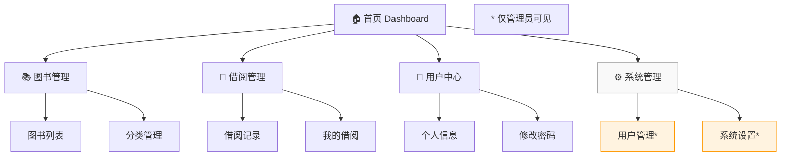
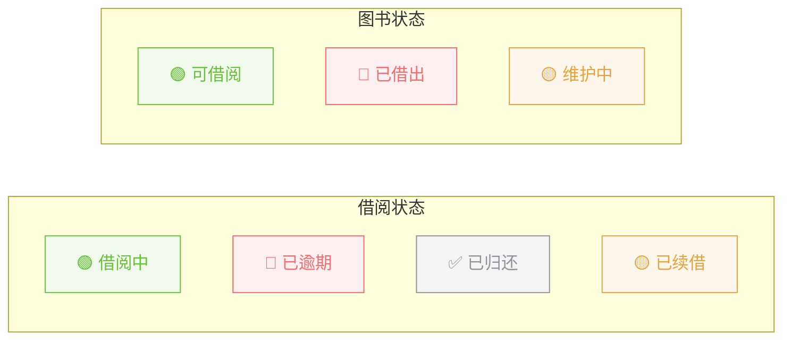
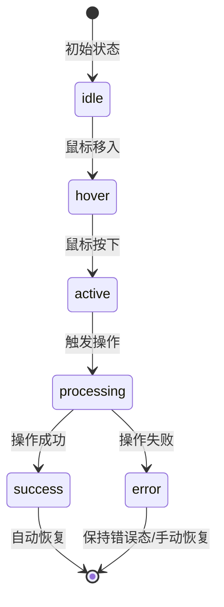

# UI/UX 交互设计规范

> **文档版本**：v1.0  
> **更新日期**：2026-04-08  
> **适用范围**：图书馆管理系统前端界面设计规范  

---

## 1. 设计原则

### 1.1 核心设计理念

| 原则 | 说明 |
|------|------|
| **简洁性** | 界面布局清晰，避免冗余元素，突出核心功能 |
| **一致性** | 统一的视觉语言、交互模式、术语使用 |
| **可用性** | 操作流程符合用户直觉，减少学习成本 |
| **响应式** | 适配不同屏幕尺寸，保证移动端体验 |
| **可访问性** | 遵循 WCAG 2.0 标准，支持无障碍访问 |

### 1.2 设计系统概览

```
┌─────────────────────────────────────────────────────────┐
│                      设计系统架构                        │
├──────────┬──────────┬──────────┬──────────┬────────────┤
│  色彩    │   字体   │   组件   │   图标   │   动效     │
│  Color   │ Typography│Component │ Icon    │ Animation  │
├──────────┼──────────┼──────────┼──────────┼────────────┤
│ 主色系   │ 字体族   │ 按钮     │ 功能图标 │ 过渡动画   │
│ 辅助色   │ 字号体系 │ 表单     │ 状态图标 │ 加载动画   │
│ 语义色   │ 行高     │ 表格     │ 导航图标 │ 反馈动画   │
│ 中性色   │ 字重     │ 卡片     │ 操作图标 │ 页面转场   │
└──────────┴──────────┴──────────┴──────────┴────────────┘
```

---

## 2. 色彩规范

### 2.1 主色调（Primary Colors）

```css
/* 主色 - 用于按钮、链接、高亮等 */
--color-primary: #409EFF;          /* 主色调 - 科技蓝 */
--color-primary-light: #66b1ff;    /* 浅主色 */
--color-primary-dark: #3a8ee6;     /* 深主色 */

/* 悬停态 */
--color-primary-hover: #66b1ff;
/* 点击态 */  
--color-primary-active: #3a8ee6;
```

### 2.2 辅助色（Secondary Colors）

```css
--color-success: #67C23A;          /* 成功/正常状态 */
--color-warning: #E6A23C;          /* 警告/待处理 */
--color-danger: #F56C6C;           /* 错误/危险操作 */
--color-info: #909399;             /* 信息提示 */
```

### 2.3 中性色（Neutral Colors）

```css
--color-text-primary: #303133;      /* 主要文字 */
--color-text-regular: #606266;      /* 常规文字 */
--color-text-secondary: #909399;    /* 次要文字 */
--color-text-placeholder: #C0C4CC;  /* 占位文字 */

--color-border: #DCDFE6;           /* 边框颜色 */
--color-border-light: #E4E7ED;     /* 浅边框 */
--color-bg-base: #F5F7FA;          /* 页面背景 */
--color-bg-white: #FFFFFF;         /* 卡片背景 */
```

### 2.4 语义色彩应用场景

| 场景 | 颜色 | 示例 |
|------|------|------|
| 可借阅图书 | `#67C23A` 绿色 | 图书列表状态标签 |
| 已借出图书 | `#F56C6C` 红色 | 图书列表状态标签 |
| 维护中图书 | `#E6A23C` 橙色 | 图书列表状态标签 |
| 已逾期借阅 | `#F56C6C` 红色 | 借阅记录状态 |
| 正常借阅中 | `#409EFF` 蓝色 | 借阅记录状态 |

---

## 3. 排版规范

### 3.1 字体家族

```css
font-family: 
  "PingFang SC",      /* 苹方 - macOS/iOS 默认中文字体 */
  "Microsoft YaHei",  /* 微软雅黑 - Windows 默认中文字体 */
  "Helvetica Neue",   
  Helvetica, Arial, 
  sans-serif;
```

### 3.2 字号体系

| 层级 | 字号(px) | 行高(px) | 字重 | 使用场景 |
|------|----------|----------|------|----------|
| H1 - 大标题 | 24 | 36 | 600 | 页面主标题 |
| H2 - 板块标题 | 20 | 32 | 600 | 区块标题 |
| H3 - 小节标题 | 18 | 28 | 500 | 卡片标题、表单组标题 |
| H4 - 列表标题 | 16 | 24 | 500 | 列表项标题 |
| Body - 正文 | 14 | 22 | 400 | 正文内容、表格数据 |
| Small - 辅助 | 13 | 20 | 400 | 辅助说明、表单提示 |
| Mini - 小字 | 12 | 18 | 400 | 标签、时间戳、脚注 |

---

## 4. 组件规范

### 4.1 页面布局结构

```
┌────────────────────────────────────────────────────────────┐
│  Header (64px)                                             │
│  ┌──────────────────────────────────────────────────────┐  │
│  │ Logo    导航菜单              搜索    用户头像       │  │
│  └──────────────────────────────────────────────────────┘  │
├──────────┬─────────────────────────────────────────────────┤
│ Sidebar  │  Main Content                                  │
│ (220px)  │  ┌───────────────────────────────────────────┐ │
│          │  │  Page Header (面包屑 + 页面标题)            │ │
│ ┌──────┐ │  ├───────────────────────────────────────────┤ │
│ │菜单项│ │  │                                           │ │
│ │菜单项│ │  │         Content Area                       │ │
│ │菜单项│ │  │         (动态内容区)                        │ │
│ │菜单项│ │  │                                           │ │
│ └──────┘ │  ├───────────────────────────────────────────┤ │
│          │  │  Pagination (分页器)                        │ │
│          │  └───────────────────────────────────────────┘ │
├──────────┴─────────────────────────────────────────────────┤
│  Footer (可选)                                             │
└────────────────────────────────────────────────────────────┘
```

### 4.2 侧边栏导航（Sidebar）

#### 导航菜单结构



#### 菜单项交互规则

| 状态 | 样式 | 说明 |
|------|------|------|
| 默认 | 文字 `#606266`，背景透明 | 普通菜单项 |
| 悬停 | 背景 `rgba(0,0,0,0.04)`，文字加深 | 鼠标悬停效果 |
| 当前激活 | 左侧 3px 蓝色竖线 + 背景 `#ecf5ff` + 文字蓝色 | 当前页面高亮 |
| 展开/收起 | 子菜单展开/折叠动画 300ms | 多级菜单切换 |

### 4.3 表格组件（Table）

#### 标准表格结构

```
┌──────────────────────────────────────────────────────────────────┐
│  📋 图书列表                          [+ 新增图书]  [📥导出]    │
├────────┬──────────┬────────┬──────────┬────────┬────────────────┤
│ ☑ 全选 │ ISBN     │ 书名   │ 作者     │ 分类   │ 操作           │
├────────┼──────────┼────────┼──────────┼────────┼────────────────┤
│ ☐      │ 978-...  │ 三国演义│ 罗贯中  │ 文学   │ ✏️ 📖 🗑️        │
│ ☐      │ 978-...  │ 西游记 │ 吴承恩  │ 文学   │ ✏️ 📖 🗑️        │
│ ☐      │ 978-...  │ 红楼梦 │ 曹雪芹  │ 文学   │ ✏️ 📖 🗑️        │
├────────┴──────────┴────────┴──────────┴────────┴────────────────┤
│ 显示 1-10 / 共 256 条    [< 1 2 3 ... 26 >]  [10条/页 ▾]        │
└──────────────────────────────────────────────────────────────────┘
```

#### 表格列配置规范

| 列类型 | 宽度建议 | 对齐方式 | 说明 |
|--------|----------|----------|------|
| 选择列 | 50px | 居左 | 复选框 |
| ID/编号 | 80px | 居左 | 固定宽度 |
| 名称类 | auto / flex | 居左 | 自适应或固定比例 |
| 数量/金额 | 120px | 居右 | 数字右对齐 |
| 状态标签 | 100px | 居中 | 居中对齐 |
| 时间日期 | 160px | 居左 | 格式统一 YYYY-MM-DD HH:mm |
| 操作列 | 200px | 居左 | 固定宽度，图标按钮 |

#### 状态标签样式



### 4.4 表单组件（Form）

#### 表单布局规范

| 类型 | 使用场景 | 布局说明 |
|------|----------|----------|
| 新增/编辑弹窗 | 数据录入 | 弹窗内表单，宽度 520px |
| 搜索筛选栏 | 列表查询 | 内联表单，一行排列 |
| 设置页面 | 配置修改 | 分区块卡片式表单 |

#### 表单字段通用规则

| 规则 | 详细说明 |
|------|----------|
| 必填标识 | 标签前红色星号 `*`，必填字段不可为空 |
| 输入限制 | 根据字段类型设置 maxlength/maxlength |
| 实时校验 | 失焦时校验，错误信息在输入框下方红字显示 |
| 提交验证 | 点击提交时全表单校验，滚动到第一个错误位置 |
| 重置功能 | 表单提供重置按钮，清空所有已填数据 |

#### 关键表单校验规则

| 字段名 | 校验规则 | 错误提示 |
|--------|----------|----------|
| 用户名 | 3-16位字母数字下划线 | 请输入3-16位的用户名 |
| 密码 | 6-20位，包含字母和数字 | 密码需6-20位，且含字母和数字 |
| 邮箱 | 合法的邮箱格式 | 请输入正确的邮箱地址 |
| 手机号 | 11位手机号码 | 请输入正确的手机号码 |
| ISBN | 10位或13位ISBN格式 | ISBN格式不正确 |
| 出版年份 | 1000-当前年份 | 年份范围无效 |
| 借阅天数 | 1-365的正整数 | 借阅天数需在1-365之间 |

### 4.5 对话框/弹窗（Dialog）

#### 弹窗尺寸规范

| 场景 | 尺寸 | 说明 |
|------|------|------|
| 确认操作 | small (420px) | 删除确认、简单确认 |
| 表单编辑 | medium (620px) | 新增/编辑图书、用户 |
| 详情查看 | large (800px) | 借阅详情、统计报表 |
| 预览图片 | 自适应 | 图片预览，按比例缩放 |

#### 弹窗交互流程

```
┌────────────────────────────────────────────────────┐
│  ⚠️ 确认删除                              [× 关闭] │
├────────────────────────────────────────────────────┤
│                                                    │
│  确定要删除图书「三国演义」吗？                     │
│  此操作不可恢复。                                   │
│                                                    │
├────────────────────────────────────────────────────┤
│                           [取消]    [确定删除 🔴]  │
└────────────────────────────────────────────────────┘

交互规则：
1. 点击遮罩层：默认关闭（可配置禁止）
2. ESC 键：关闭弹窗
3. 确定：执行操作后自动关闭
4. 取消/关闭：不做任何操作直接关闭
5. 操作中：确定按钮显示 loading，禁用点击
```

### 4.6 消息提示（Message & Notification）

#### 消息类型与触发场景

| 类型 | 图标 | 触发场景 | 自动消失时间 |
|------|------|----------|-------------|
| 成功 | ✅ | 新增/编辑/删除成功 | 3秒 |
| 错误 | ❌ | 操作失败、权限不足 | 5秒 |
| 警告 | ⚠️ | 重复提交、即将过期 | 4秒 |
| 信息 | ℹ️ | 一般提示 | 3秒 |

#### 消息位置

```
页面顶部居中（推荐用于全局通知）：
┌──────────────────────────────────────────┐
│          ✅ 操作成功！                    │
│          图书「三国演义」已成功添加       │
└──────────────────────────────────────────┘

右上角悬浮（推荐用于后台通知）：
                    ┌────────────────────┐
                    │ ℹ️ 新的借阅请求    │
                    │ 用户张三申请借阅... │
                    │              [×]   │
                    └────────────────────┘
```

---

## 5. 页面设计规范

### 5.1 登录页面（Login）

```
┌────────────────────────────────────────────────────────────┐
│                                                            │
│                    ┌──────────────────┐                    │
│                    │                  │                    │
│                    │   📚 Logo        │                    │
│                    │   图书馆管理系统  │                    │
│                    │                  │                    │
│                    │  ┌────────────┐  │                    │
│                    │  │ 👤 用户名  │  │                    │
│                    │  └────────────┘  │                    │
│                    │  ┌────────────┐  │                    │
│                    │  │ 🔒 密码    │  │                    │
│                    │  └────────────┘  │                    │
│                    │                  │                    │
│                    │  ┌──────────┐ ┌──┴┐                 │
│                    │  │ A7XK     │ 🖼️ │  ← 点击可刷新    │
│                    │  └──────────┘ └───┘                 │
│                    │       看不清？换一个                   │
│                    │                  │                    │
│                    │  [    登 录    ]  │                    │
│                    │                  │                    │
│                    │  还没有账号？ 立即注册                  │
│                    └──────────────────┘                    │
│                                                            │
└────────────────────────────────────────────────────────────┘
```

**设计要点**：
- 居中卡片布局，宽度 420px
- 支持回车键提交登录（验证码输入框也支持回车）
- 验证码区域：左侧输入框 + 右侧图片（120×46px）
- 验证码图片支持点击刷新，hover 时边框高亮
- 输入框内字母间距加宽（letter-spacing: 4px），方便辨识
- 登录失败后自动刷新验证码
- 错误提示在表单上方显示

### 5.2 仪表盘首页（Dashboard）

```
┌────────────────────────────────────────────────────────────┐
│  首页 > 仪表盘                                             │
├────────────────────────────────────────────────────────────┤
│                                                            │
│  ┌─────────────┐  ┌─────────────┐  ┌─────────────┐  ┌────┐│
│  │ 📚 总图书数  │  │ 👥 注册用户  │  │ 📖 今日借阅  │  │⚠️  ││
│  │    1,256    │  │    358      │  │     42     │  │逾期 ││
│  │   ↑ 12%    │  │   ↑ 5%     │  │   ↑ 18%    │  │  8  ││
│  └─────────────┘  └─────────────┘  └─────────────┘  └────┘│
│                                                            │
│  ┌──────────────────────────┐  ┌────────────────────────┐  │
│  │ 📈 借阅趋势图             │  │ 🔥 热门图书 TOP 10     │  │
│  │                          │  │  1. 三国演义  (89次)    │  │
│  │   [折线图/柱状图区域]     │  │  2. 西游记  (76次)     │  │
│  │                          │  │  3. 红楼梦  (65次)     │  │
│  │                          │  │  ...                   │  │
│  └──────────────────────────┘  └────────────────────────┘  │
│                                                            │
│  ┌──────────────────────────────────────────────────────┐  │
│  │ 📋 最近借阅记录                                       │  │
│  │  张三 借阅了《三国演义》    2026-04-08 14:30         │  │
│  │  李四 归还了《Python编程》  2026-04-08 13:15         │  │
│  └──────────────────────────────────────────────────────┘  │
│                                                            │
└────────────────────────────────────────────────────────────┘
```

### 5.3 图书列表页面（Book List）

```
┌────────────────────────────────────────────────────────────┐
│  首页 > 图书管理 > 图书列表                                 │
├────────────────────────────────────────────────────────────┤
│                                                            │
│  ┌─────────────────────────────────────────────────────┐   │
│  │ 🔍 书名/ISBN/作者  [搜索]  ▼高级筛选                 │   │
│  │                                                     │   │
│  │ 高级筛选区域（可折叠）：                              │   │
│  │ 分类:[全部▾] 状态:[全部▾]  出版社:[请选择▾]          │   │
│  │ 出版年:[____] ~ [____]  [重置] [查询]               │   │
│  └─────────────────────────────────────────────────────┘   │
│                                                            │
│  [+ 新增图书]  [📥 导出Excel]  [🗑️ 批量删除]              │
│                                                            │
│  ┌──────────────────────────────────────────────────────┐  │
│  │ ☐ │ 封面  │ ISBN    │ 书名    │ 作者 │ 状态 │ 操作 │  │
│  │ ───┼──────┼─────────┼─────────┼──────┼──────┼────── │  │
│  │ ☐ │ 📕   │978-7..  │三国演义  │罗贯中│🟢可借│✏️📖🗑│  │
│  │ ☐ │ 📘   │978-7..  │西游记   │吴承恩│🔴借出│✏️  🗑│  │
│  └──────────────────────────────────────────────────────┘  │
│                                                            │
│  共 256 条记录  [< 1 2 3 ... 26 >]  [10条/页 ▾]           │
└────────────────────────────────────────────────────────────┘
```

### 5.4 借阅详情页面（Borrow Detail）

```
┌────────────────────────────────────────────────────────────┐
│  首页 > 借阅管理 > 借阅详情                                 │
├────────────────────────────────────────────────────────────┤
│                                                            │
│  ┌──────────────────────────────────────────────────────┐  │
│  │  借阅单号：BOR-20260408-0001                         │  │
│  └──────────────────────────────────────────────────────┘  │
│                                                            │
│  ┌─────────────────────┐  ┌─────────────────────────────┐  │
│  │ 📚 图书信息          │  │ 👤 借阅人信息               │  │
│  │                     │  │                             │  │
│  │ 书名：三国演义       │  │ 姓名：张三                  │  │
│  │ 作者：罗贯中         │  │ 学工号：STU20240001         │  │
│  │ ISBN：978-7-xxx      │  │ 联系方式：138****8888       │  │
│  │ 分类：文学-古典      │  │ 用户类型：学生              │  │
│  │ 出版社：人民文学     │  │                             │  │
│  └─────────────────────┘  └─────────────────────────────┘  │
│                                                            │
│  ┌──────────────────────────────────────────────────────┐  │
│  │  ⏰ 借阅时间线                                        │  │
│  │                                                     │  │
│  │  ● 2026-04-08 14:30  申请借阅                        │  │
│  │  │                                                  │  │
│  │  ● 2026-04-08 14:31  审核通过，借出图书              │  │
│  │  │                                                  │  │
│  │  ○ 2026-05-08 14:30  应还日期（预计）                │  │
│  │                                                     │  │
│  │  ─ ─ ─ ─ ─ ─ ─ ─ ─ ─ ─ ─ ─ ─ ─ ─ ─ ─ ─ ─ ─ ─   │  │
│  │  ○ 归还日期（待完成）                                │  │
│  └──────────────────────────────────────────────────────┘  │
│                                                            │
│  [返回列表]  [📄 打印借阅单]  [🔄 续借]  [✅ 手动归还]     │
└────────────────────────────────────────────────────────────┘
```

---

## 6. 交互动效规范

### 6.1 过渡动画参数

| 动画类型 | 时长 | 缓动函数 | 使用场景 |
|----------|------|----------|----------|
| 快速过渡 | 150ms | ease-in-out | 颜色变化、hover 效果 |
| 标准过渡 | 300ms | ease-in-out | 展开/收起、淡入淡出 |
| 页面切换 | 350ms | ease-out | 路由切换动画 |
| 模态弹窗 | 250ms | cubic-bezier(.4, 0, .2, 1) | Dialog 出现/消失 |
| 下拉菜单 | 200ms | ease | Select/Dropdown 展开 |

### 6.2 Loading 状态

| 场景 | Loading 样式 |
|------|--------------|
| 页面加载 | 骨架屏（Skeleton） |
| 按钮加载 | 按钮内 spinner + 文字变为"处理中..." |
| 表格加载 | 表格中心 v-loading 遮罩 |
| 数据请求 | 局部区域 loading 遮罩 |

### 6.3 反馈动效



---

## 7. 响应式断点

| 断点名称 | 宽度范围 | 设备 | 布局策略 |
|----------|----------|------|----------|
| xs | < 768px | 手机 | 单列布局，隐藏侧边栏 |
| sm | >= 768px | 平板竖屏 | 折叠侧边栏，调整间距 |
| md | >= 992px | 平板横屏/小笔记本 | 正常侧边栏 |
| lg | >= 1200px | 桌面显示器 | 完整布局 |
| xl | >= 1920px | 大屏显示器 | 加宽内容区 |

---

## 8. 无障碍设计（A11y）

### 8.1 键盘导航要求

| 操作 | 快捷键 | 说明 |
|------|--------|------|
| Tab | Tab | 在可交互元素间顺序移动 |
| Shift+Tab | Shift + Tab | 反向移动焦点 |
| Enter/Space | Enter / Space | 激活当前聚焦元素 |
| Esc | Escape | 关闭弹窗、取消操作、退出全屏 |
| Ctrl+F | Ctrl + F | 聚焦到搜索框 |

### 8.2 屏幕阅读器支持

- 所有图片必须设置有意义的 `alt` 属性
- 图标按钮需添加 `aria-label`
- 表格需正确使用 `<th>` 和 scope 属性
- 表单标签需关联 `for` 和 `id`
- 动态更新的区域需标记 `aria-live`

---

## 9. 异常状态设计

### 9.1 空状态（Empty State）

```
┌──────────────────────────────────────┐
│                                      │
│           📭                         │
│                                      │
│      暂无借阅记录                    │
│      您还没有借过任何图书哦~         │
│                                      │
│      [📚 去浏览图书]                 │
│                                      │
└──────────────────────────────────────┘
```

### 9.2 错误状态（Error State）

```
┌──────────────────────────────────────┐
│                                      │
│           ❌                         │
│                                      │
│      加载失败                        │
│      网络连接异常，请稍后重试         │
│                                      │
│      [🔄 重新加载]                   │
│                                      │
└──────────────────────────────────────┘
```

### 9.3 403 无权限页面

```
┌──────────────────────────────────────┐
│                                      │
│           🔒                         │
│                                      │
│      403 无权访问                    │
│      抱歉，您没有访问此页面的权限     │
│                                      │
│      [🏠 返回首页]                   │
│                                      │
└──────────────────────────────────────┘
```

### 9.4 404 页面不存在

```
┌──────────────────────────────────────┐
│                                      │
│           🧭                         │
│                                      │
│      404 页面未找到                  │
│      您访问的页面可能已被移除        │
│                                      │
│      [🏠 返回首页]  [← 返回上页]     │
│                                      │
└──────────────────────────────────────┘
```

---

## 附录 A：常用图标映射表

| 功能 | 图标 | Unicode / Element Plus |
|------|------|------------------------|
| 新增 | ➕ | Plus |
| 编辑 | ✏️ | Edit |
| 删除 | 🗑️ | Delete |
| 查看 | 👁️ | View / Search |
| 搜索 | 🔍 | Search |
| 导出 | 📥 | Download |
| 筛选 | 🔽 | Filter |
| 重置 | 🔄 | Refresh |
| 确认 | ✅ | Check / CircleCheck |
| 取消 | ❌ | Close / CircleClose |
| 警告 | ⚠️ | Warning |
| 图书 | 📚 | Reading / Notebook |
| 用户 | 👤 | User |
| 设置 | ⚙️ | Setting |
| 首页 | 🏠 | House |

---

*文档结束*
